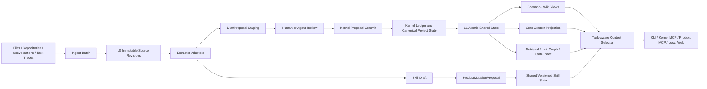

# Shared Mind Product Roadmap

| 항목 | 값 |
|---|---|
| 문서 버전 | 1.2.0 |
| 기준일 | 2026-08-14 |
| 상태 | DEV-029~079 구현 완료 기준선; hosted CI는 외부 결제 제한으로 실행 차단 |
| 대상 저장소 | `ArthurCore/shared-mind` |
| 구현 브랜치 | `agent/product-roadmap-implementation` |
| 참고 프로젝트 | `TencentCloud/TencentDB-Agent-Memory` |

## 1. 제품 목표

Shared Mind는 AI, 모델, 도구 또는 세션이 바뀌어도 하나의 프로젝트 상태를 유지한다.
Agent는 자기만의 프로젝트 기억을 소유하지 않는다. 모든 Agent는 동일한 Shared State를 관찰하고, 현재 작업에 필요한 context만 같은 규칙으로 선택해 받는다.

> **Project has state. Agents come and go.**

```text
Agent A memory != Agent B memory      # 금지
Shared Mind(A) == Shared Mind(B)      # 필수
Context(task A) != Context(task B)    # 허용
```

제품 흐름은 다음과 같다.

```text
문서 / 대화 / 코드 / 작업 trace
        ↓
immutable SourceRevision 등록
        ↓
검토 가능한 DraftProposal 또는 Skill Draft 생성
        ↓
사실·결정·질문·작업: kernel Proposal commit
절차적 Skill: ProductMutationProposal commit
        ↓
ONE Shared State 갱신
        ↓
Scenario / Core / Wiki / Retrieval / Code view 재생성
        ↓
ContextRequest(task/query/ref/budget)
        ↓
어떤 Agent에서도 결정적인 context로 작업 재개
```

## 2. Architecture Invariants

1. **One Shared State**: Agent, 모델, 역할, 세션별 canonical memory partition을 만들지 않는다.
2. **Same state, different view**: task가 다르면 context 세부 항목은 달라질 수 있지만 underlying state는 동일하다.
3. **Model-independent context**: 동일 state, `ContextRequest`, selector version, budget은 호출 모델과 무관하게 동일 context hash를 만든다.
4. **Shared Core Context**: 목적, active decision, critical constraint, open conflict/question, current work는 특정 Agent의 소유물이 아니다.
5. **Task-aware selection, not Agent loadout**: AgentProfile, fixed AssetBinding, role memory를 사용하지 않는다.
6. **No hidden memory fork**: 승인된 변경은 다음 모든 세션이 동일 state에서 관찰할 수 있어야 한다.
7. **Two explicit mutation boundaries**:
   - factual/project state는 kernel `Proposal`과 append-only ledger를 통과한다.
   - shared Skill state는 versioned/idempotent `ProductMutationProposal`, receipt, audit hash chain, replay를 통과한다.
8. **No direct mutation**: LLM, UI, MCP adapter가 kernel 또는 product DB를 직접 수정하지 않는다.
9. **Evidence authority**: active factual Claim은 검증 가능한 EvidenceLink를 가져야 한다.
10. **Conflict preservation**: 사실 모순은 양쪽 Claim을 남기고, stale non-commutative write는 적용하지 않는다.
11. **Disposable derived views**: Scenario, Core, Wiki, retrieval index, CodeGraph, context pack은 삭제 후 재생성 가능해야 한다.
12. **Local-first/provider-neutral**: 특정 LLM, embedding provider, vector DB 또는 TencentDB를 필수 의존성으로 만들지 않는다.

## 3. Tencent 아이디어 재검토 결과

| Tencent 개념 | 결정 | Shared Mind 적용 |
|---|---|---|
| Chat Memory 자동 추출 | 변형 채택 | 대화를 immutable source로 보존하고 DraftProposal 후보를 만든다. Agent별 Chat Memory는 만들지 않는다. |
| LLM-Wiki | 변형 채택 | canonical L1 객체를 연결하는 재생성 가능한 Scenario/Wiki view로 사용한다. |
| Skill | 변형 채택 | Agent 소유물이 아닌 shared versioned procedural state로 관리한다. |
| Agent Loadout | 제외 | `ContextRequest` 기반 Task-aware Context Selection으로 대체한다. |
| AgentProfile / role memory | 제외 | role은 선택 힌트일 수 있으나 memory partition key가 아니다. |
| Fixed Asset Binding | 제외 | 특정 Agent에 knowledge/Skill을 영구 장착하지 않는다. |
| Agent-restricted memory | 현재 제외 | local Shared Mind 내부에 Agent별 지식 단절을 만들지 않는다. 외부 공개 범위는 remote policy로 제어한다. |
| Cold Start import | 채택 | repo·문서·대화 ingest부터 첫 handoff까지 단일 흐름으로 제공한다. |
| Default Agent profile | 제외 | Agent identity 대신 project bootstrap policy와 기본 ContextRequest를 제공한다. |
| CodeGraph | 변형 채택 | source revision에서 재생성 가능한 비권위 index로 구현한다. |
| Memory Hub | 변형 채택 | Agent binding UI가 아니라 shared state review/control surface로 사용한다. |
| L0 Raw | 채택 | SourceRevision과 conversation/task trace가 evidence authority다. |
| L1 Atom | 채택 | Claim, Evidence, Decision, Question, WorkItem이 atomic shared state다. |
| L2 Scenario | 변형 채택 | 관련 L1 객체를 묶는 deterministic derived view다. |
| L3 Persona/Core | 별도 truth로 제외 | canonical state에서 `Core Context Projection`을 재생성한다. |
| Automatic Skill extraction | 변형 채택 | Skill Draft까지만 자동화하고 TESTED/APPROVED 승격은 검증을 요구한다. |
| Version/status/provenance | 채택 | 모든 canonical/product mutation과 derived artifact에 감사 가능한 provenance를 둔다. |
| Vector retrieval | 선택 채택 | FTS5/BM25가 기본이고 vector/RRF는 optional adapter다. |
| On-demand tools | 채택 | source span, Scenario, Skill, symbol, impact path를 필요할 때 읽는다. |
| Proxy automatic injection | 변형 채택 | 숨은 Agent memory가 아니라 명시적 ContextRequest 결과를 주입한다. |
| Team ACL/RBAC | 후순위 | 실제 multi-user 요구가 확인된 뒤 project/user access control로 검토한다. |

## 4. 구현 아키텍처



### 4.1 권위 구분

| 데이터 | 권위 | 저장/검증 |
|---|---|---|
| Source, Claim, Evidence, Conflict, Decision, Question, WorkItem | kernel canonical project state | kernel Proposal, ledger, receipt, replay |
| Skill | shared procedural product state | ProductMutationProposal, receipt, audit hash chain, version guard, replay |
| Draft | 비권위 staging | product store, review lifecycle |
| Scenario, Core, Wiki, retrieval, CodeGraph | 비권위 derived view | dependency digest, deterministic rebuild |
| Context pack | 요청별 projection | ContextRequest + selector version + budget |

## 5. Milestone 5 — Trusted Automatic Ingest

**상태: 완료**

- [x] **DEV-029 — IngestBatch와 manifest**: 파일·디렉터리·JSONL 대화 ingest 단위, fingerprint, 상태, 오류 기록.
- [x] **DEV-030 — Extractor interface**: deterministic extractor와 optional model-backed extractor 공통 계약.
- [x] **DEV-031 — DraftProposal staging store**: edit/reject/expire/commit lifecycle과 canonical DB 분리.
- [x] **DEV-032 — Review CLI/MCP**: ingest, extract, draft list/show/edit/reject/commit 흐름.
- [x] **DEV-033 — Extraction provenance**: extractor/model/prompt/parameter/source revision provenance.
- [x] **DEV-034 — Resource and policy boundary**: source scope, timeout, item/character/token cap, disclosure policy.
- [x] **DEV-035 — Extraction conformance/eval**: malformed input, invalid span, resume, unchanged re-import, duplicate, partial failure 시험.

**완료 결과**

- 수동 Proposal JSON 없이 source → Draft → review → commit → context 흐름이 동작한다.
- unchanged re-import의 duplicate는 0이다.
- extraction failure와 rejected Draft는 kernel ledger head를 전진시키지 않는다.
- committed factual Claim은 검증 가능한 source byte span을 가진다.

## 6. Milestone 6 — Scenario and Core Context Views

**상태: 완료**

- [x] **DEV-036 — DerivedArtifact contract**: level/scope/member/dependency digest/builder/provenance/lifecycle.
- [x] **DEV-037 — L1 normalization map**: Claim/Decision/Question/WorkItem 공통 atomic envelope.
- [x] **DEV-038 — Scenario builder**: project/feature/incident/decision thread 기준 deterministic grouping.
- [x] **DEV-039 — Core Context Projection**: purpose, active decisions, constraints, conflicts, questions, work를 canonical state에서 생성.
- [x] **DEV-040 — Dependency digest and invalidation**: 영향받은 derived artifact만 stale/rebuild.
- [x] **DEV-041 — Layer-aware context selection**: Core/Scenario bootstrap 후 task 관련 L1/L0 추가.
- [x] **DEV-042 — Drill-down projection**: derived view에서 object/evidence/receipt/source revision 추적.

**완료 결과**

- Core는 별도 authoritative fact를 생성하지 않는다.
- open conflict가 관련된 view는 양쪽 Claim과 conflict ID를 표시한다.
- 동일 state/builder version은 동일 output hash를 만든다.
- 근거 요구 시 L1/L0 source span까지 내려갈 수 있다.

## 7. Milestone 7 — Shared Versioned Skill State

**상태: 완료**

- [x] **DEV-043 — SkillRecord contract**: purpose, trigger, preconditions, steps, resources, outputs, validation, provenance, status.
- [x] **DEV-044 — Skill mutation proposal**: create/import/revise/promote/deprecate, idempotency, expected state hash와 version guard.
- [x] **DEV-045 — Task trace importer**: conversation/tool/task trace에서 Skill Draft 생성.
- [x] **DEV-046 — Skill review/promotion**: DRAFT → TESTED → APPROVED → DEPRECATED lifecycle.
- [x] **DEV-047 — Portable Skill package**: resource fingerprint와 validation metadata를 보존하는 export/import.
- [x] **DEV-048 — Skill retrieval/execution eval**: task relevance 선택, validation 실행, reuse outcome 측정.

**완료 결과**

- Skill은 Agent별 복사본이 아니라 하나의 shared identity/version을 참조한다.
- 검증되지 않은 Skill은 APPROVED로 승격되지 않는다.
- stale Skill update는 product transaction conflict로 거부된다.
- product receipts와 audit hash chain을 재생해 동일 Skill state hash를 검증한다.
- kernel schema는 `1.3.0`을 유지하며 Skill history가 frozen kernel ledger를 소급 변경하지 않는다.

## 8. Milestone 8 — One Shared State Context Routing

**상태: 완료**

- [x] **DEV-049 — ContextRequest contract**: task, purpose, query, ref, depth, budget, optional hints.
- [x] **DEV-050 — Shared Core Context policy**: 공통으로 우선 포함할 project state 규칙.
- [x] **DEV-051 — Task relevance selector**: task/query/ref와 L1/Scenario/Skill/index stable ranking.
- [x] **DEV-052 — Budgeted context assembler**: Core + Task Context + drill-down pointer, omission metadata.
- [x] **DEV-053 — CLI/service/MCP integration**: `--task`, `--query`, `--ref`, `--budget-*` 동일 의미.
- [x] **DEV-054 — Selection trace/parity eval**: 포함·제외 이유와 cross-client context hash parity.

**완료 결과**

- Agent별 canonical table, profile memory, fixed binding이 없다.
- 동일 state/request/version/budget은 호출 Agent와 무관하게 동일 context hash를 만든다.
- task가 달라져도 Core Context와 underlying state는 공유된다.
- budget accounting과 included/omitted reason이 결과에 남는다.

## 9. Milestone 9 — Zero-Relearning Cold Start

**상태: 완료**

- [x] **DEV-055 — Bulk document importer**: repo docs, Markdown, text, code의 manifest 기반 등록.
- [x] **DEV-056 — Conversation session importer**: Codex/Claude/general JSONL와 original timestamp 보존.
- [x] **DEV-057 — Default project bootstrap policy**: generic Core Context와 ContextRequest preset.
- [x] **DEV-058 — Cold-start build report**: imported/unchanged/failed/draft/committed/stale/conflict 집계.
- [x] **DEV-059 — First handoff pack**: purpose, decisions, questions, work, source map, next action.
- [x] **DEV-060 — Single-command workflow**: ingest → extract → commit policy → build → context.

**완료 결과**

- 새 workspace에 repo·문서·conversation export를 넣고 첫 handoff를 생성한다.
- 재실행은 변경분만 처리한다.
- build report 수치가 실제 store 상태와 일치한다.
- 한 client가 만든 state를 다른 client가 동일 context 규칙으로 복원한다.

## 10. Milestone 10 — Retrieval, Wiki, and Code Understanding

**상태: 완료**

- [x] **DEV-061 — FTS5/BM25 retrieval**: local lexical search, filters, stable ranking, fallback.
- [x] **DEV-062 — Optional vector/RRF adapter**: optional embedding result와 lexical result 결합.
- [x] **DEV-063 — Wiki link graph**: Scenario/source/Claim/Decision/Skill 관계 graph.
- [x] **DEV-064 — Code index v1**: Python file/symbol/definition/reference index.
- [x] **DEV-065 — CodeGraph v2**: caller/callee와 change-impact path.
- [x] **DEV-066 — On-demand tool protocol**: capability discovery와 source/span/scenario/skill/symbol/impact 조회.
- [x] **DEV-067 — Retrieval quality eval**: relevance, conflict exposure, evidence traceability, cost, latency.

**완료 결과**

- lexical-only mode가 dependency-free 기본값이다.
- optional vector adapter가 없어도 correctness가 유지된다.
- 검색 결과는 provenance와 source/evidence pointer를 보존한다.
- index/graph 삭제 후 source와 shared state에서 재생성할 수 있다.

## 11. Milestone 11 — Governance and Control Surface

**상태: 완료**

- [x] **DEV-068 — Unified catalog**: atomic state, derived view, Skill, Wiki, Code index metadata 조회.
- [x] **DEV-069 — Lifecycle/review attribution**: status, proposer, reviewer, provenance.
- [x] **DEV-070 — Review queues**: Draft, stale artifact, conflict, Skill promotion queue.
- [x] **DEV-071 — Local web control surface**: loopback-only UI/API와 service boundary 재사용.
- [x] **DEV-072 — Backup/export/migration**: kernel, sources, product state, metadata의 검증 가능한 package.

**완료 결과**

- UI가 DB를 직접 수정하지 않는다.
- 상세 조회에서 source, derivation, version, lifecycle, proposer/reviewer를 확인한다.
- Agent별 binding 관리 화면은 존재하지 않는다.
- backup/restore 후 kernel state root와 product state hash를 검증한다.

## 12. Milestone 12 — Continuous Compounding and Product Evaluation

**상태: 완료**

- [x] **DEV-073 — Post-task capture**: fact/decision/question/work/Skill 후보를 staging에 생성.
- [x] **DEV-074 — Incremental consolidation**: 변경 dependency의 view/index만 갱신.
- [x] **DEV-075 — Usage and feedback events**: 조회·사용·실패 telemetry.
- [x] **DEV-076 — Memory quality metrics**: evidence validity, conflict recall, staleness, duplicate, provenance.
- [x] **DEV-077 — Context routing metrics**: relevance, irrelevant context, Core preservation, parity, cost.
- [x] **DEV-078 — Skill reuse benchmark**: 성공률, rework, turns, validation 비교.
- [x] **DEV-079 — Cold-start benchmark**: manual explanation baseline 대비 정확도·비용·연속성 비교.

**완료 결과**

- quality와 efficiency를 별도 지표로 판정한다.
- 자동 ingest/consolidation을 꺼도 kernel 기능은 유지된다.
- compounding loop가 kernel/product mutation boundary를 우회하지 않는다.
- 반복 가능한 fixture와 product evaluation artifact를 제공한다.

## 13. 구현된 인터페이스

```text
shared-mind                 Kernel CLI와 task-aware context compatibility path
shared-mind-mcp             Optional kernel MCP
shared-mind-product         Ingest, Draft, views, Skill, retrieval, governance
shared-mind-product-mcp     분리된 product MCP
shared-mind-web             Loopback-only local control surface
```

주요 구현 모듈:

```text
src/shared_mind/product.py
src/shared_mind/product_store.py
src/shared_mind/product_contract.py
src/shared_mind/product_ingest.py
src/shared_mind/memory_views.py
src/shared_mind/retrieval.py
src/shared_mind/skills.py
src/shared_mind/product_mcp_server.py
src/shared_mind/web_control.py
```

## 14. 검증 기준선

### 14.1 완료된 로컬 검증

- kernel contract validator 통과.
- product contract validator 통과: **11 positive fixtures + 10 negative fixtures**.
- 안정된 전체 회귀 기준선: **385 tests, 0 failures, 2 skipped, branch coverage 82%**.
- 제품 중심 회귀군: **46 tests 통과**.
- 별도 확장 실행에서 discovery된 **388 tests가 모두 test assertion을 통과**했으나, 동시에 실행된 두 coverage runner가 `.coverage.*`를 상호 삭제해 해당 실행의 합산 coverage 수치는 증거로 사용하지 않는다.
- Ruff가 원격 quality job에서 보고한 unused import/local 11건 제거.
- compileall 통과.
- wheel build와 metadata/content 검사 통과.
- wheel에 product modules, product contract/fixtures와 5개 console entrypoint 포함 확인.
- macOS와 Ubuntu deterministic subsets 통과; Windows에서도 deterministic test steps 통과.
- process-heavy 테스트가 일반 병렬 worker와 SQLite/CPU를 경쟁하지 않도록 coverage runner에 exclusive lane 추가.
- durability barrier ready file을 atomic rename으로 공개해 부분 JSON 관찰 race 제거.

### 14.2 Hosted GitHub Actions 상태

최종 branch CI는 코드 checkout 또는 test 실행 전에 GitHub가 runner 할당을 거부했다.
GitHub annotation은 최근 결제 실패 또는 Actions spending limit 증가가 필요하다고 명시한다.
따라서 이 상태는 **test failure가 아니라 외부 실행 인프라 차단**으로 기록한다.

Hosted CI가 다시 활성화되면 다음 8개 job이 최종 확인 대상이다.

1. Python 3.11 contract + full branch coverage.
2. Python 3.12 contract + full branch coverage.
3. Python 3.13 contract + full branch coverage.
4. Ubuntu determinism.
5. macOS determinism.
6. Windows determinism.
7. Compile/Ruff/mypy/dependency audit/Bandit.
8. Fresh wheel install and all entrypoint smoke.

## 15. Definition of Done

DEV 작업은 다음 조건을 만족할 때 완료로 본다.

- 관련 contract/schema/version 영향이 명시돼 있다.
- factual/project mutation은 kernel Proposal만 사용한다.
- Skill mutation은 ProductMutationProposal만 사용한다.
- accepted/rejected/idempotent/stale/replay 경로가 시험된다.
- model-backed 결과는 extractor/model/prompt/input provenance를 보존한다.
- derived artifact는 dependency digest와 재생성 방법을 가진다.
- open conflict와 evidence traceability가 view/context에서 유지된다.
- local deterministic mode가 존재한다.
- CLI/Python/MCP 의미가 일치한다.
- failure는 stable machine-readable reason code를 반환한다.
- README/SRS/architecture/roadmap이 실제 구현과 일치한다.

## 16. 현재 성공 지표

| 지표 | 기준 |
|---|---|
| Agent/session-specific canonical partition | 0 |
| canonical direct-write bypass | 0 |
| silent overwrite | 0 |
| committed factual Claim evidence validity | 100% |
| open conflict exposure | 100% |
| unchanged re-import duplicate | 0 |
| derived artifact provenance completeness | 100% |
| deterministic rebuild | 동일 state/version에서 동일 hash |
| manual Proposal JSON dependency | 기본 ingest 흐름에서 제거 |
| unreviewed Skill auto-promotion | 0 |
| same state/request/version/budget cross-client parity | 동일 context hash |

## 17. 이후 범위

DEV-029~079 이후의 기능은 현재 완료 기준선에 포함하지 않는다.
실제 dogfooding 지표와 사용 요구가 확인된 뒤 별도 milestone/ADR로 추가한다.

- multi-tenant cloud service와 distributed database.
- 조직/팀 RBAC와 외부 identity provider.
- 모든 언어의 범용 CodeGraph.
- mandatory vector DB 또는 mandatory embedding provider.
- LLM이 사실 진위를 자동 확정하는 curator.
- 검토 없는 Skill 자동 승격.
- Agent별 memory/loadout/binding.
- TencentDB 또는 특정 vendor runtime 종속.

---

최종 판단 기준은 기능 수가 아니다.

> **다음 AI가 프로젝트를 다시 설명받지 않고 같은 상태에서 일을 이어가며, 그 편의성을 얻는 과정에서 근거·충돌·결정·변경 이력이 손실되지 않는가?**
