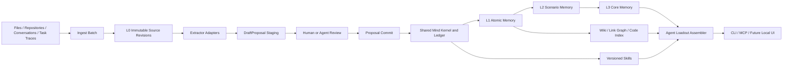

# Shared Mind Product Roadmap

| 항목 | 값 |
|---|---|
| 문서 버전 | 1.0.0 |
| 기준일 | 2026-08-14 |
| 상태 | 다음 구현 목표 기준선 |
| 대상 저장소 | `ArthurCore/shared-mind` |
| 참고 프로젝트 | `TencentCloud/TencentDB-Agent-Memory` |

## 1. 목표

Shared Mind의 검증·충돌·ledger·replay 커널은 유지한다. 다음 단계에서는 이 기반 위에 문서, 대화, 코드와 작업 경험을 자동으로 수집하고 계층화해, 각 에이전트가 자기 역할에 필요한 기억과 Skill만 받아 바로 일을 이어갈 수 있는 제품 계층을 구현한다.

> **목표 제품 정의:** Shared Mind는 여러 AI가 공유하는 자료·사실·결정·질문·작업 상태와 절차적 경험을 근거와 변경 이력을 잃지 않고 축적하고, 역할별 에이전트가 필요한 수준의 기억을 안전하게 이어받게 하는 local-first Shared Cognitive State다.

첫 제품화 목표는 다음 한 흐름이다.

```text
문서/대화 투입
  → immutable source 등록
  → 기억 후보 자동 추출
  → DraftProposal 검토
  → Proposal commit
  → L0~L3 계층 기억 생성
  → Agent별 loadout 조립
  → 다음 세션이 재설명 없이 작업 시작
```

## 2. 현재 강점과 제품 공백

현재 Shared Mind는 immutable source revision, evidence-backed Claim, FACT_CONFLICT와 TRANSACTION_CONFLICT 분리, Decision/OpenQuestion/WorkItem, append-only ledger, deterministic replay/projection, JSON CLI와 MCP를 제공한다.

다음 공백을 제품 목표로 전환한다.

| 공백 | 현재 상태 | 목표 상태 |
|---|---|---|
| 자동 기억 생성 | source 등록 후 Proposal JSON을 에이전트가 직접 구성 | source·대화에서 검토 가능한 DraftProposal 자동 생성 |
| 계층형 기억 | 객체와 handoff context 중심 | L0 Raw, L1 Atom, L2 Scenario, L3 Core 계층과 drill-down |
| 절차적 기억 | 사실·결정·질문·작업 중심 | trigger, steps, resources, validation을 가진 versioned Skill |
| Agent별 기억 배분 | 동일 workspace context를 공통 소비 | AgentProfile과 AssetBinding 기반 role-specific loadout |
| Cold start | 개별 source add와 수동 Proposal 구성 | repo·문서·대화 일괄 import 후 첫 context까지 단일 흐름 |
| 지식 탐색 | structured query와 deterministic context | lexical 우선 hybrid retrieval, link graph, on-demand tool 호출 |
| 코드 이해 | source text로만 취급 | 재생성 가능한 symbol/file/call 관계 index |
| 기억 운영 | CLI/MCP 중심 | review, version, status, provenance, binding을 관리하는 control surface |
| 지속적 학습 | 명시적 commit 중심 | 작업 종료 후 후보 기억·Skill을 만들고 검토 후 누적하는 loop |
| 제품 평가 | continuity와 integrity 평가 중심 | extraction, routing, Skill reuse, cold-start 효과까지 정량 평가 |

## 3. Tencent 아이디어의 Shared Mind식 적용

Tencent의 개념을 그대로 복제하지 않고 Shared Mind의 무결성 모델에 맞게 변환한다.

| 참고 개념 | Shared Mind 적용 | 권위 모델 |
|---|---|---|
| Chat Memory | 대화 import 후 Claim, Decision, Question, WorkItem 후보 추출 | 후보는 DraftProposal, 승인 후 ledger-backed canonical state |
| LLM-Wiki | L1 객체를 묶는 L2 Scenario page와 link graph | 기본은 재생성 가능한 projection |
| Skill | version, trigger, steps, resources, validation을 가진 `SkillRecord` | Proposal을 통해 승인·변경되는 1급 객체 |
| Agent Loadout | `AgentProfile` + `AssetBinding` + context/tool assembler | binding과 scope는 auditable state |
| Cold Start | repo·문서·대화 bulk import, default profile, build report | import는 idempotent하고 모든 파생물에 provenance 보존 |
| CodeGraph | file, symbol, reference, call 관계 derived index | canonical source에서 재생성 가능한 비권위 index |
| Memory Hub | local review/control surface | canonical mutation은 기존 Proposal API만 호출 |
| L0~L3 Memory | Raw → Atom → Scenario → Core | 상위 계층은 하위 객체 ID와 digest를 통해 추적 가능 |

## 4. 변경하지 않을 핵심 원칙

1. LLM 출력은 canonical memory에 직접 쓰지 않는다.
2. 모든 canonical mutation은 Proposal commit을 통과한다.
3. factual Claim은 검증 가능한 EvidenceLink 없이 active가 될 수 없다.
4. L0 source bytes와 revision hash는 변경하지 않는다.
5. 상위 기억은 하위 source/object/proposal까지 역추적 가능해야 한다.
6. FACT_CONFLICT는 한쪽을 자동 삭제하지 않고 열린 상태로 노출한다.
7. stale semantic write는 기존 TRANSACTION_CONFLICT 규칙으로 거부한다.
8. Wiki, retrieval index, CodeGraph와 context pack은 canonical truth가 아니라 재생성 가능한 view다.
9. local-first와 provider neutrality를 유지하고 embedding이나 특정 LLM을 필수 의존성으로 만들지 않는다.
10. 모든 Agent에게 전체 기억을 주지 않고 최소 범위 loadout을 구성한다.

## 5. 목표 아키텍처



### 5.1 기억 계층

| 계층 | 내용 | 성격 |
|---|---|---|
| L0 Raw | 원문, 대화 transcript, task trace, code revision | immutable evidence authority |
| L1 Atom | Claim, EvidenceLink, Decision, OpenQuestion, WorkItem | canonical atomic state |
| L2 Scenario | 프로젝트·기능·사건별로 관련 L1 객체를 묶은 기억 | deterministic derived artifact |
| L3 Core | 장기 목적, 원칙, 안정된 선호, 핵심 제약 | review를 거친 장기 memory artifact |
| Skill | 반복 가능한 작업 방법과 검증 규칙 | versioned procedural memory |

## 6. 구현 마일스톤

### Milestone 5 — Trusted Automatic Ingest

**우선순위: P0**  
**목표:** 사용자가 Proposal JSON을 직접 작성하지 않아도 문서와 대화에서 evidence-backed 기억 후보를 만들고 검토 후 커밋한다.

- [ ] **DEV-029 — IngestBatch와 manifest**: 파일·디렉터리·JSONL 대화 import 단위를 정의하고 batch ID, source fingerprint, 상태, 오류를 기록한다.
- [ ] **DEV-030 — Extractor interface**: deterministic extractor와 optional model-backed extractor가 같은 입력·출력 계약을 사용하게 한다.
- [ ] **DEV-031 — DraftProposal staging store**: 추출 결과를 canonical DB와 분리해 저장하고 edit/reject/expire 상태를 지원한다.
- [ ] **DEV-032 — Review CLI/MCP**: `ingest`, `extract`, `draft list/show/edit/reject/commit` 흐름을 추가한다.
- [ ] **DEV-033 — Extraction provenance**: extractor, model, prompt version, parameters, generated_at, input source revision hash를 보존한다.
- [ ] **DEV-034 — Resource and policy boundary**: source scope, timeout, item/character/token cap, remote disclosure policy를 추출 단계에도 적용한다.
- [ ] **DEV-035 — Extraction conformance and eval**: malformed input, invalid span, resume, unchanged re-import, duplicate candidate, partial failure를 시험한다.

**완료 기준**

- 한 명령으로 지원 source를 등록하고 DraftProposal을 생성한다.
- unchanged re-import의 중복 source와 중복 memory는 0건이다.
- 추출 실패와 검토 거부는 ledger head를 전진시키지 않는다.
- 커밋된 factual Claim의 evidence 검증률은 100%다.
- end-to-end fixture에서 Proposal JSON을 사람이 직접 작성하지 않고 context까지 생성한다.

### Milestone 6 — Hierarchical Memory and Consolidation

**우선순위: P0**  
**목표:** 다음 에이전트가 L2/L3로 빠르게 상황을 복원하고 필요할 때 L1/L0까지 근거를 따라 내려간다.

- [ ] **DEV-036 — MemoryArtifact contract**: level, scope, title, summary, member object IDs, dependency digest, builder version, provenance, lifecycle을 정의한다.
- [ ] **DEV-037 — L1 normalization map**: 기존 Claim/Decision/Question/WorkItem을 공통 atomic-memory envelope로 읽는 projection을 만든다.
- [ ] **DEV-038 — L2 Scenario builder**: project, feature, incident, decision thread 기준으로 L1 객체를 묶는 deterministic builder를 구현한다.
- [ ] **DEV-039 — L3 Core builder**: 목적, 원칙, 안정된 제약과 장기 profile 후보를 만들고 명시적 review/promotion을 요구한다.
- [ ] **DEV-040 — Dependency digest and invalidation**: 하위 객체 변경 시 영향을 받은 L2/L3만 stale 처리하고 재생성한다.
- [ ] **DEV-041 — Layer-aware context selection**: L3/L2 bootstrap 후 query에 따라 L1/L0 evidence를 추가하는 budgeted selector를 만든다.
- [ ] **DEV-042 — Drill-down projection**: 모든 상위 기억에서 member object, evidence locator, proposal receipt와 source revision으로 이동할 수 있게 한다.

**완료 기준**

- 동일 ledger와 builder version에서 L2/L3 출력이 byte-identical하다.
- open conflict가 관련된 상위 기억은 양쪽 Claim과 conflict ID를 반드시 표시한다.
- L3만으로 진위를 확정하지 않고 근거 요구 시 L1/L0를 반환한다.
- 하위 객체 하나의 변경이 무관한 memory artifact를 불필요하게 재생성하지 않는다.
- 기존 handoff 품질을 유지하면서 bootstrap context의 중복 정보가 감소한다.

### Milestone 7 — Versioned Skill Memory

**우선순위: P1**  
**목표:** 성공한 작업 방법을 재사용 가능한 절차적 기억으로 축적한다.

- [ ] **DEV-043 — SkillRecord schema**: `skill_id`, version, purpose, trigger boundaries, preconditions, steps, resources, expected outputs, validation rules, provenance, status를 정의한다.
- [ ] **DEV-044 — Skill Proposal operations**: create, revise, deprecate, promote 연산과 stale version guard를 추가한다.
- [ ] **DEV-045 — Task trace importer**: conversation/tool-call/task trace에서 Skill 후보를 DraftProposal로 생성한다.
- [ ] **DEV-046 — Skill review and promotion**: DRAFT → TESTED → APPROVED → DEPRECATED lifecycle과 검토 근거를 구현한다.
- [ ] **DEV-047 — Portable Skill package**: Skill 본문과 resource files, fingerprints, validation metadata를 export/import한다.
- [ ] **DEV-048 — Skill execution adapter and eval**: 에이전트가 Skill을 조회·장착하고 검증 단계를 실행하며 reuse 성공률을 측정한다.

**완료 기준**

- 작업 trace 하나에서 Skill 후보를 만들고 검토 후 승인할 수 있다.
- Skill은 단순 prompt text가 아니라 versioned resources와 validation rules를 가진다.
- 검증되지 않은 Skill은 기본 loadout에 자동 포함되지 않는다.
- export/import 후 identity, version, resource hash와 validation metadata가 보존된다.

### Milestone 8 — Agent Profiles and Loadouts

**우선순위: P1**  
**목표:** Scout, Builder, Reviewer 등 역할별 에이전트가 같은 canonical state에서 서로 다른 최소 기억 집합을 받는다.

- [ ] **DEV-049 — AgentProfile**: agent ID, role, purpose, capabilities, source scope, default budget, trust mode를 정의한다.
- [ ] **DEV-050 — AssetBinding**: memory/Skill/index를 Agent에 fixed 또는 query-routed 방식으로 연결하고 priority와 pinned version을 기록한다.
- [ ] **DEV-051 — Local visibility model**: 최소 `private`, `project`, `agent-restricted` 범위를 제공하고 기본값을 deny-by-default로 둔다.
- [ ] **DEV-052 — Loadout assembler**: profile, binding, query, scope, budget을 결합해 context와 callable tools를 결정한다.
- [ ] **DEV-053 — CLI/MCP integration**: `context --agent`, `agent show`, `binding list/set/remove`와 agent-scoped MCP resource를 제공한다.
- [ ] **DEV-054 — Routing audit and eval**: 어떤 자산이 왜 포함·제외됐는지 설명하고 역할별 relevance/leakage를 측정한다.

**완료 기준**

- 최소 세 개 역할 profile이 동일 workspace에서 서로 다른 loadout을 받는다.
- restricted 자산이 권한 없는 Agent의 context와 tool result에 노출되지 않는다.
- loadout 결정에는 포함 이유, binding, scope, version과 budget accounting이 남는다.
- profile을 바꿔도 canonical knowledge를 복제하지 않는다.

### Milestone 9 — Zero-Relearning Cold Start

**우선순위: P1**  
**목표:** 기존 프로젝트를 가져왔을 때 새 에이전트가 프로젝트를 처음부터 다시 읽지 않고 시작한다.

- [ ] **DEV-055 — Bulk document importer**: repo 내 docs, Markdown, text와 설정한 경로를 manifest 기반으로 일괄 등록한다.
- [ ] **DEV-056 — Conversation session importer**: JSONL 기반 Codex/Claude/일반 conversation adapter와 원래 timestamp 보존을 구현한다.
- [ ] **DEV-057 — Default project profile**: init 후 바로 사용할 수 있는 Builder profile과 최소 binding preset을 제공한다.
- [ ] **DEV-058 — Cold-start build report**: imported, unchanged, failed, draft, committed, stale artifact와 unresolved conflict를 한 화면/JSON으로 보고한다.
- [ ] **DEV-059 — First handoff pack**: 목적, 핵심 결정, 열린 질문, 진행 작업, source map과 추천 next actions를 생성한다.
- [ ] **DEV-060 — Single-command workflow**: bulk ingest → extract → review queue → build → context의 비대화식 자동화 경로를 제공한다.

**완료 기준**

- 새 workspace에 repo, 문서, conversation export를 넣고 첫 handoff pack을 만들 수 있다.
- 재실행은 변경분만 처리하며 unchanged 항목을 다시 추출하지 않는다.
- build report의 수치가 실제 source, draft, receipt, artifact 상태와 일치한다.
- 새 Agent가 handoff pack만으로 목적·결정·질문·작업을 정확히 복원한다.

### Milestone 10 — Retrieval, Wiki, and Code Understanding

**우선순위: P1/P2**  
**목표:** 전체 기억을 prompt에 넣지 않고 필요할 때 정확한 page, evidence와 code 관계를 호출한다.

- [ ] **DEV-061 — FTS5/BM25 retrieval**: local lexical retrieval, filters, stable ranking과 deterministic fallback을 구현한다.
- [ ] **DEV-062 — Optional vector/RRF adapter**: embedding을 optional plugin으로 두고 lexical/vector 결과를 RRF로 결합한다.
- [ ] **DEV-063 — Wiki link graph**: L2 page, source, Claim, Decision, Skill 사이의 재생성 가능한 link graph를 만든다.
- [ ] **DEV-064 — Code index v1**: repository revision에서 file, symbol, definition/reference 관계를 추출한다.
- [ ] **DEV-065 — CodeGraph v2**: 지원 언어부터 caller/callee와 change-impact path를 추가한다.
- [ ] **DEV-066 — On-demand tool protocol**: Agent가 capability를 발견하고 page, source span, symbol, impact path를 필요할 때만 읽게 한다.
- [ ] **DEV-067 — Retrieval quality eval**: relevant recall, conflict exposure, evidence traceability, context bytes/tokens와 latency를 측정한다.

**완료 기준**

- lexical-only mode가 dependency-free 기본값으로 동작한다.
- optional vector adapter가 없어도 기능과 correctness가 저하되지 않는다.
- 검색 결과는 source/evidence/provenance를 포함한다.
- Code index와 link graph를 삭제해도 canonical source에서 재생성할 수 있다.

### Milestone 11 — Memory Governance and Control Surface

**우선순위: P2**  
**목표:** 사람이 기억 후보, provenance, 충돌, version과 Agent binding을 검토할 수 있는 운영 표면을 제공한다.

- [ ] **DEV-068 — Unified asset catalog**: Atom, Scenario, Core, Skill, Wiki, Code index metadata를 공통 목록으로 조회한다.
- [ ] **DEV-069 — Lifecycle and ownership**: DRAFT/REVIEWED/APPROVED/STALE/DEPRECATED 상태와 owner/reviewer를 기록한다.
- [ ] **DEV-070 — Review queues**: extraction candidate, stale artifact, conflict, Skill promotion과 access change queue를 제공한다.
- [ ] **DEV-071 — Local web control surface**: CLI/service 계약을 재사용하는 local-only UI를 구현한다.
- [ ] **DEV-072 — Backup, export, migration**: canonical ledger, sources, approved assets와 bindings를 검증 가능한 package로 내보낸다.

**완료 기준**

- UI가 DB를 직접 수정하지 않고 기존 service/Proposal 경계만 호출한다.
- asset 상세 화면에서 source, derivation, version, owner, status, bindings와 사용 기록을 확인한다.
- export/import 후 ledger verify와 state root parity가 유지된다.

### Milestone 12 — Continuous Compounding and Product Evaluation

**우선순위: P1/P2**  
**목표:** 매 작업의 결과가 다음 작업의 품질을 높이는지 측정 가능한 loop를 만든다.

- [ ] **DEV-073 — Post-task capture**: 작업 종료 시 새로운 fact, decision, question, work state와 Skill 후보를 staging에 만든다.
- [ ] **DEV-074 — Incremental consolidation**: 변경된 dependency만 대상으로 L2/L3와 indexes를 갱신한다.
- [ ] **DEV-075 — Usage and feedback events**: 어떤 memory/Skill이 조회·장착·채택·실패했는지 개인정보를 최소화해 기록한다.
- [ ] **DEV-076 — Memory quality metrics**: evidence validity, contradiction recall, staleness, duplicate rate, provenance completeness를 평가한다.
- [ ] **DEV-077 — Agent loadout metrics**: relevant asset recall, irrelevant leakage, context cost와 task outcome을 비교한다.
- [ ] **DEV-078 — Skill reuse benchmark**: Skill 미사용/사용 조건에서 성공률, 재작업, turns와 validation 통과율을 비교한다.
- [ ] **DEV-079 — Cold-start benchmark**: 수동 재설명 baseline과 handoff/loadout 방식의 정확도·context 비용·작업 연속성을 비교한다.

**완료 기준**

- quality와 cost 지표를 분리해 품질 통과를 효율 통과로 오인하지 않는다.
- 자동 추출·consolidation을 꺼도 기존 kernel 기능이 동일하게 동작한다.
- compounding loop가 직접 canonical write를 우회하지 않는다.
- 동일 fixture에서 반복 실행 가능한 product benchmark artifact를 남긴다.

## 7. 실행 순서

### NOW — 첫 제품화 목표

Milestone 5와 6만 먼저 구현한다.

1. `DEV-029~031`: ingest manifest, extractor contract, DraftProposal staging
2. `DEV-032~035`: review/commit surface, provenance, policy, conformance
3. `DEV-036~038`: MemoryArtifact와 L1/L2 builder
4. `DEV-039~042`: L3 review, invalidation, layered context와 drill-down

**NOW의 최종 사용자 시나리오**

```text
shared-mind ingest ./project --conversation sessions.jsonl
shared-mind extract <batch-id>
shared-mind draft review <draft-id>
shared-mind draft commit <draft-id>
shared-mind context --purpose "continue implementation"
```

명령 이름은 구현 과정에서 계약 검토 후 확정하지만, 사용자가 수동 Proposal JSON 없이 위 흐름을 완료해야 한다.

### NEXT — 재사용 가능한 Agent Team

Milestone 7, 8, 9 순서로 Skill, Agent loadout, cold start를 구현한다.

### LATER — 탐색과 운영 확장

Milestone 10, 11, 12의 retrieval, CodeGraph, UI, governance와 compounding loop를 실제 dogfooding 지표에 따라 구현한다.

## 8. 지금 시작하지 않을 항목

다음 항목은 NOW 완료를 막지 않는다.

- 멀티테넌트 cloud service와 distributed database
- 완전한 조직/팀 RBAC와 외부 identity provider
- 모든 언어를 지원하는 범용 CodeGraph
- mandatory vector database 또는 mandatory embedding provider
- LLM이 사실의 진위를 자동 확정하는 curator
- 검토 없는 자동 Skill 승격
- CLI/MCP 흐름보다 먼저 만드는 대형 dashboard
- 모든 Agent에게 모든 memory를 기본 주입하는 방식
- TencentDB나 특정 vendor에 대한 runtime 종속성

## 9. 공통 Definition of Done

각 DEV 작업은 다음 조건을 모두 충족해야 완료다.

- 관련 contract/schema/version과 호환성 영향이 명시되어 있다.
- canonical mutation은 Proposal commit만 사용한다.
- accepted, rejected, replay, migration 경로가 자동 시험된다.
- model-backed 결과는 extractor/model/prompt/input provenance를 보존한다.
- derived artifact는 dependency digest와 재생성 방법을 가진다.
- open conflict와 evidence traceability가 projection/context에서 유지된다.
- local-only deterministic mode가 존재한다.
- CLI, Python service, MCP envelope의 의미가 일치한다.
- failure는 stable machine-readable reason code를 반환한다.
- contract validation, 전체 test suite와 관련 product eval이 통과한다.
- README/SRS/ROADMAP이 현재 구현과 일치한다.

## 10. 프로젝트 성공 지표

| 지표 | 목표 |
|---|---|
| canonical write bypass | 0건 |
| silent overwrite | 0건 |
| committed factual Claim evidence validity | 100% |
| open conflict exposure | 100% |
| unchanged re-import duplicate | 0건 |
| derived artifact provenance completeness | 100% |
| deterministic rebuild parity | 동일 input/version에서 동일 output hash |
| manual Proposal JSON dependency | 기본 end-to-end 흐름에서 제거 |
| cross-session explanation reduction | 기존 SRS baseline 대비 최소 50% 감소 목표 유지 |
| role-scoped disclosure violation | 0건 |
| Skill auto-promotion without review | 0건 |

## 11. 첫 구현 단위

첫 코드 변경은 `DEV-029~035`를 하나의 거대한 PR로 묶지 않는다.

1. **Contracts PR**: IngestBatch, ExtractorResult, DraftProposal, provenance schema와 fixtures
2. **Staging PR**: staging persistence, idempotent batch state, failure/resume semantics
3. **Surface PR**: CLI/service/MCP review·commit 흐름과 deterministic extractor
4. **Optional Model Adapter PR**: remote policy와 resource caps를 재사용하는 provider-neutral adapter
5. **Evaluation PR**: document/conversation fixture, evidence accuracy, duplicate, rollback, cold-start precursor metrics

첫 번째 release gate는 다음 질문 하나로 판단한다.

> **사용자가 프로젝트 문서와 대화를 넣었을 때, Shared Mind가 근거가 붙은 기억 후보를 만들고 사람이 검토한 뒤 안전하게 누적하여 다음 에이전트가 이어받게 할 수 있는가?**

이 질문에 end-to-end 자동 시험으로 “예”라고 답하기 전에는 Skill, Agent loadout, UI와 CodeGraph의 범위를 넓히지 않는다.
