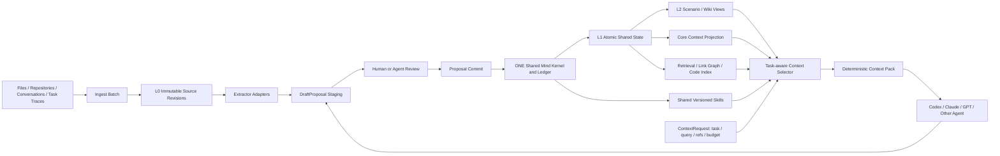

# Shared Mind Product Roadmap

| 항목 | 값 |
|---|---|
| 문서 버전 | 1.1.0 |
| 기준일 | 2026-08-14 |
| 상태 | 다음 구현 목표 기준선 |
| 대상 저장소 | `ArthurCore/shared-mind` |
| 참고 프로젝트 | `TencentCloud/TencentDB-Agent-Memory` |

## 1. 목표

Shared Mind의 검증·충돌·ledger·replay 커널은 유지한다. 다음 단계에서는 이 기반 위에 문서, 대화, 코드와 작업 경험을 자동으로 수집하고, **모든 AI/Agent/세션이 하나의 동일한 canonical Shared State를 이어받도록** 제품 계층을 구현한다.

> **목표 제품 정의:** Shared Mind는 AI나 세션이 바뀌어도 하나의 공유 상태를 유지하며, 자료·사실·결정·질문·작업 상태와 절차적 경험을 근거와 변경 이력을 잃지 않고 축적하고, 현재 작업에 필요한 context를 같은 상태에서 결정적으로 만들어 주는 local-first Shared Cognitive State다.

첫 제품화 목표는 다음 한 흐름이다.

```text
문서/대화 투입
  → immutable source 등록
  → 기억 후보 자동 추출
  → DraftProposal 검토
  → Proposal commit
  → ONE canonical Shared State 갱신
  → Scenario/Core/Index view 재생성
  → Task-aware context 선택
  → 어떤 AI/세션에서도 동일 상태를 이어서 작업
```

## 2. Architecture Invariants

아래 원칙은 이후 기능보다 우선한다.

1. **One Shared State:** Agent, 모델, 세션별 canonical memory partition을 만들지 않는다.
2. **Same state, different view:** 작업이 다르면 context에 포함되는 세부정보는 달라질 수 있지만 underlying Shared State는 동일하다.
3. **Model-independent context:** 동일한 state, `ContextRequest`, selector version, budget이면 Codex/Claude/GPT 등 호출 주체와 무관하게 동일한 context 결과를 만든다.
4. **Core context is shared:** 프로젝트 목적, 현재 주요 결정, 중요 제약, 열린 사실 충돌, 핵심 열린 질문, 현재 작업 상태는 특정 Agent의 소유물이 아니다.
5. **Task-aware selection, not Agent loadout:** 역할이나 모델 이름으로 기억을 소유·배분하지 않고 현재 task/query/references를 context selection 입력으로 사용한다.
6. **No hidden memory fork:** 어떤 Agent가 작업한 결과도 승인 후 동일 Shared State로 돌아와 다음 모든 세션이 볼 수 있어야 한다.
7. **Proposal-only mutation:** LLM이나 UI가 canonical memory에 직접 쓰지 않는다.
8. **Evidence authority:** factual Claim은 검증 가능한 EvidenceLink 없이 active가 될 수 없다.
9. **Conflict preservation:** FACT_CONFLICT는 한쪽을 자동 삭제하지 않고, stale semantic write는 TRANSACTION_CONFLICT로 거부한다.
10. **Derived views are disposable:** Scenario/Wiki/CodeGraph/retrieval index/context pack은 canonical truth가 아니며 Shared State와 source에서 재생성할 수 있어야 한다.
11. **Local-first/provider-neutral:** 특정 LLM, embedding provider, vector DB, TencentDB를 필수 의존성으로 만들지 않는다.

핵심 관계는 다음 세 줄로 고정한다.

```text
Agent A memory != Agent B memory      # 금지
Shared Mind(A) == Shared Mind(B)      # 필수
Context(task A) != Context(task B)    # 허용
```

## 3. 현재 강점과 제품 공백

현재 Shared Mind는 immutable source revision, evidence-backed Claim, FACT_CONFLICT와 TRANSACTION_CONFLICT 분리, Decision/OpenQuestion/WorkItem, append-only ledger, deterministic replay/projection, JSON CLI와 MCP를 제공한다.

| 공백 | 현재 상태 | 목표 상태 |
|---|---|---|
| 자동 기억 생성 | source 등록 후 Proposal JSON을 에이전트가 직접 구성 | source·대화에서 검토 가능한 DraftProposal 자동 생성 |
| 지식 압축/연결 | atomic 객체와 handoff context 중심 | L1에서 재생성되는 Scenario view와 Core Context projection |
| 절차적 기억 | 사실·결정·질문·작업 중심 | trigger, steps, resources, validation을 가진 shared versioned Skill |
| Context 선택 | workspace 공통 handoff 중심 | 하나의 Shared State에서 task-aware deterministic context 생성 |
| Cold start | 개별 source add와 수동 Proposal 구성 | repo·문서·대화 일괄 import 후 첫 context까지 단일 흐름 |
| 지식 탐색 | structured query와 deterministic context | lexical 우선 hybrid retrieval, link graph, on-demand tool 호출 |
| 코드 이해 | source text로만 취급 | 재생성 가능한 symbol/file/call 관계 index |
| 기억 운영 | CLI/MCP 중심 | review, version, status, provenance를 관리하는 control surface |
| 지속적 학습 | 명시적 commit 중심 | 작업 종료 후 후보 기억·Skill을 만들고 검토 후 동일 Shared State에 누적 |
| 제품 평가 | continuity와 integrity 평가 중심 | extraction, context selection, Skill reuse, cold-start 효과까지 정량 평가 |

## 4. Tencent 아이디어 재검토

TencentDB Agent Memory의 기능을 그대로 복제하지 않고 Shared Mind의 목표와 충돌 여부를 기준으로 다시 분류한다.

| Tencent 개념 | 결정 | Shared Mind 적용 |
|---|---|---|
| Chat Memory 자동 추출 | **변형 채택** | 대화는 SourceRevision으로 보존하고 Claim/Decision/Question/WorkItem을 DraftProposal로 추출한다. 별도 Agent별 Chat Memory를 만들지 않는다. |
| LLM-Wiki | **변형 채택** | L1 canonical 객체를 연결하는 Scenario/Wiki projection으로 만든다. Wiki page 자체는 truth가 아니다. |
| Skill | **변형 채택** | 모든 Agent가 공유 가능한 versioned `SkillRecord`로 저장한다. 자동 추출은 후보만 만들고 검토 없이 승인하지 않는다. |
| Agent Loadout | **제외** | Agent별 memory binding을 만들지 않는다. `ContextRequest` 기반 Task-aware Context Selection으로 대체한다. |
| AgentProfile / role memory | **제외** | role은 필요하면 task metadata로만 사용한다. role별 기억 저장소나 canonical scope를 만들지 않는다. |
| Fixed Asset Binding | **제외** | 특정 Agent에 knowledge/Skill을 고정 장착하지 않는다. 현재 task에 필요한 shared asset을 query-time에 선택한다. |
| Agent-restricted memory ACL | **현재 제외** | local Shared Mind 안에서 Agent별 지식 차단으로 기억 단절을 만들지 않는다. 외부 disclosure는 기존 remote policy 경계에서 다룬다. |
| Cold Start import | **채택** | repo·문서·대화 bulk import → DraftProposal → Shared State → 첫 handoff/context 흐름을 만든다. |
| Default Agent / Builder profile | **제외** | 기본 Agent identity 대신 기본 `ContextRequest`/project bootstrap policy를 제공한다. |
| CodeGraph | **변형 채택** | file/symbol/reference/call 관계를 source revision에서 재생성 가능한 비권위 index로 만든다. |
| Memory Hub | **변형 채택** | local review/control surface로 사용하되 DB 직접 수정, Agent binding 중심 UI는 금지한다. |
| L0 Conversation/Raw | **채택** | immutable SourceRevision과 task/conversation trace가 evidence authority다. |
| L1 Atom | **채택** | 기존 Claim/Evidence/Decision/OpenQuestion/WorkItem을 atomic shared state로 본다. |
| L2 Scenario | **변형 채택** | 관련 L1 객체를 묶는 deterministic derived view로 만든다. |
| L3 Persona/Core | **별도 memory로는 제외** | 장기 사실·제약은 L1 canonical state에 남기고, 핵심 상태는 `Core Context Projection`으로 매번 재생성한다. stale한 별도 Persona/Core truth를 만들지 않는다. |
| Automatic Skill extraction | **변형 채택** | task trace에서 Skill Draft를 만들되 TESTED/APPROVED 승격은 검토와 validation을 요구한다. |
| Memory version/status/provenance | **채택** | canonical 객체와 derived artifact/Skill의 version, provenance, lifecycle을 감사 가능하게 유지한다. |
| Team/User custom extraction prompts | **변형 채택** | project-level optional extractor configuration으로 허용하고 prompt/model/version provenance를 남긴다. |
| Retrieval + vector search | **선택 채택** | FTS/BM25를 기본으로 하고 vector/RRF는 optional adapter다. |
| On-demand memory tools | **채택** | 모든 것을 prompt에 넣지 않고 필요할 때 source span, Scenario, Skill, code relation을 읽는다. |
| Proxy의 자동 memory injection | **변형 채택** | adapter가 숨은 Agent별 memory를 주입하지 않고 명시적 `ContextRequest`를 Shared Mind에 보내 deterministic context를 받는다. |
| Usage counts / feedback | **선택 채택** | correctness authority가 아닌 product telemetry로만 사용하며 canonical truth 판정에는 사용하지 않는다. |
| Team ACL/RBAC | **후순위** | 실제 multi-user 요구가 생길 때 project/user access control로 검토한다. Agent별 memory divergence를 만드는 방식은 사용하지 않는다. |

## 5. 목표 아키텍처



### 5.1 기억과 View의 구분

| 계층/객체 | 내용 | 권위 |
|---|---|---|
| L0 Raw | 원문, 대화 transcript, task trace, code revision | immutable evidence authority |
| L1 Atomic Shared State | Claim, EvidenceLink, Decision, OpenQuestion, WorkItem | canonical state |
| L2 Scenario/Wiki | 프로젝트·기능·사건별로 관련 L1 객체를 묶은 view | deterministic derived artifact |
| Core Context | 장기 목적, 현재 주요 결정, 중요 제약, 열린 충돌/질문/작업의 핵심 요약 | deterministic projection; 별도 truth 아님 |
| Skill | 반복 가능한 작업 방법과 검증 규칙 | shared versioned procedural state |
| Retrieval/CodeGraph | 검색과 코드 관계 | disposable derived index |

## 6. 구현 마일스톤

### Milestone 5 — Trusted Automatic Ingest

**우선순위: P0**  
**목표:** 사용자가 Proposal JSON을 직접 작성하지 않아도 문서와 대화에서 evidence-backed 기억 후보를 만들고 검토 후 커밋한다.

- [ ] **DEV-029 — IngestBatch와 manifest**: 파일·디렉터리·JSONL 대화 import 단위를 정의하고 batch ID, source fingerprint, 상태, 오류를 기록한다.
- [ ] **DEV-030 — Extractor interface**: deterministic extractor와 optional model-backed extractor가 같은 입력·출력 계약을 사용하게 한다.
- [ ] **DEV-031 — DraftProposal staging store**: 추출 결과를 canonical DB와 분리해 저장하고 edit/reject/expire 상태를 지원한다.
- [ ] **DEV-032 — Review CLI/MCP**: `ingest`, `extract`, `draft list/show/edit/reject/commit` 흐름을 추가한다.
- [ ] **DEV-033 — Extraction provenance**: extractor, model, prompt version, parameters, generated_at, input source revision hash를 보존한다.
- [ ] **DEV-034 — Resource and policy boundary**: source scope, timeout, item/character/token cap, remote disclosure policy를 추출 단계에도 적용한다.
- [ ] **DEV-035 — Extraction conformance and eval**: malformed input, invalid span, resume, unchanged re-import, duplicate candidate, partial failure를 시험한다.

**완료 기준**

- 한 명령으로 지원 source를 등록하고 DraftProposal을 생성한다.
- unchanged re-import의 중복 source와 중복 memory는 0건이다.
- 추출 실패와 검토 거부는 ledger head를 전진시키지 않는다.
- 커밋된 factual Claim의 evidence 검증률은 100%다.
- end-to-end fixture에서 Proposal JSON을 사람이 직접 작성하지 않고 context까지 생성한다.

### Milestone 6 — Shared Memory Views and Core Context

**우선순위: P0**  
**목표:** 다음 세션이 핵심 상태를 빠르게 복원하고 필요할 때 atomic state와 원문 근거까지 내려간다. 별도 L3 truth를 만들지 않는다.

- [ ] **DEV-036 — DerivedMemoryArtifact contract**: view type, scope, title, summary, member object IDs, dependency digest, builder version, provenance, stale state를 정의한다.
- [ ] **DEV-037 — L1 normalization map**: 기존 Claim/Decision/Question/WorkItem을 공통 atomic-memory envelope로 읽는 projection을 만든다.
- [ ] **DEV-038 — L2 Scenario builder**: project, feature, incident, decision thread 기준으로 L1 객체를 묶는 deterministic builder를 구현한다.
- [ ] **DEV-039 — Core Context Projection**: 목적, active decision, critical constraint, open conflict/question, current work를 canonical state에서 결정적으로 생성한다.
- [ ] **DEV-040 — Dependency digest and invalidation**: 하위 객체 변경 시 영향을 받은 derived view/index만 stale 처리하고 재생성한다.
- [ ] **DEV-041 — Layer-aware context selection**: Core/L2 bootstrap 후 task/query에 따라 L1/L0 evidence를 추가하는 budgeted selector를 만든다.
- [ ] **DEV-042 — Drill-down projection**: 모든 상위 view에서 member object, evidence locator, proposal receipt와 source revision으로 이동할 수 있게 한다.

**완료 기준**

- 동일 ledger와 builder version에서 Scenario/Core output이 byte-identical하다.
- open conflict가 관련된 상위 view는 양쪽 Claim과 conflict ID를 반드시 표시한다.
- Core Context가 별도의 authoritative fact를 생성하지 않는다.
- 근거 요구 시 L1/L0까지 내려갈 수 있다.
- 하위 객체 하나의 변경이 무관한 derived artifact를 불필요하게 재생성하지 않는다.

### Milestone 7 — Shared Versioned Skill Memory

**우선순위: P1**  
**목표:** 성공한 작업 방법을 특정 Agent의 소유물이 아닌 공유 절차적 기억으로 축적한다.

- [ ] **DEV-043 — SkillRecord schema**: `skill_id`, version, purpose, trigger boundaries, preconditions, steps, resources, expected outputs, validation rules, provenance, status를 정의한다.
- [ ] **DEV-044 — Skill Proposal operations**: create, revise, deprecate, promote 연산과 stale version guard를 추가한다.
- [ ] **DEV-045 — Task trace importer**: conversation/tool-call/task trace에서 Skill 후보를 DraftProposal로 생성한다.
- [ ] **DEV-046 — Skill review and promotion**: DRAFT → TESTED → APPROVED → DEPRECATED lifecycle과 검토 근거를 구현한다.
- [ ] **DEV-047 — Portable Skill package**: Skill 본문과 resource files, fingerprints, validation metadata를 export/import한다.
- [ ] **DEV-048 — Skill retrieval/execution eval**: 현재 task에 relevant한 Skill을 shared catalog에서 선택하고 검증 단계를 실행하며 reuse 성공률을 측정한다.

**완료 기준**

- 작업 trace 하나에서 Skill 후보를 만들고 검토 후 승인할 수 있다.
- Skill은 단순 prompt text가 아니라 versioned resources와 validation rules를 가진다.
- 검증되지 않은 Skill은 context selector가 기본 추천하지 않는다.
- Skill은 Agent별 복사본이 아니라 하나의 shared version을 참조한다.
- export/import 후 identity, version, resource hash와 validation metadata가 보존된다.

### Milestone 8 — One Shared State Context Routing

**우선순위: P1**  
**목표:** 어떤 Agent/모델/세션이 요청하더라도 하나의 Shared State에서 현재 작업에 필요한 context를 같은 규칙으로 선택한다.

- [ ] **DEV-049 — ContextRequest contract**: task, purpose, query, referenced object/source/file, desired depth, budget과 optional hints를 정의한다. Agent ID나 모델명은 memory partition key로 사용하지 않는다.
- [ ] **DEV-050 — Shared Core Context policy**: 프로젝트 목적, active decision, critical constraint, open conflict/question, current work 중 항상 또는 우선 포함할 항목을 deterministic rule로 정의한다.
- [ ] **DEV-051 — Task relevance selector**: task/query/reference와 L1/L2/Skill/index를 결합해 관련 항목을 stable ranking으로 선택한다.
- [ ] **DEV-052 — Budgeted context assembler**: Core Context + Task Context + drill-down pointers를 budget 안에서 조립하고 omission metadata를 남긴다.
- [ ] **DEV-053 — CLI/MCP integration**: `context --task`, `--query`, `--ref`, `--budget-*`와 동일 의미의 service/MCP request를 제공한다.
- [ ] **DEV-054 — Selection trace and parity eval**: 각 항목의 포함·제외 이유를 설명하고 동일 ContextRequest를 Codex/Claude/GPT가 요청했을 때 context hash parity를 검증한다.

**완료 기준**

- Agent별 canonical memory table, profile memory, fixed asset binding이 존재하지 않는다.
- 동일 state + ContextRequest + selector version + budget은 호출 Agent와 무관하게 동일 context hash를 만든다.
- task가 달라지면 세부 context는 달라질 수 있으나 Core Context와 underlying state는 동일하다.
- context 결과에는 included/omitted 이유와 budget accounting이 남는다.
- 어떤 세션의 승인된 변경도 다음 다른 세션에서 같은 Shared State를 통해 관찰할 수 있다.

### Milestone 9 — Zero-Relearning Cold Start

**우선순위: P1**  
**목표:** 기존 프로젝트를 가져왔을 때 새 세션이 프로젝트를 처음부터 다시 읽지 않고 시작한다.

- [ ] **DEV-055 — Bulk document importer**: repo 내 docs, Markdown, text와 설정한 경로를 manifest 기반으로 일괄 등록한다.
- [ ] **DEV-056 — Conversation session importer**: JSONL 기반 Codex/Claude/일반 conversation adapter와 원래 timestamp 보존을 구현한다.
- [ ] **DEV-057 — Default project bootstrap policy**: 특정 Builder profile이 아니라 프로젝트 공통 Core Context와 generic ContextRequest preset을 제공한다.
- [ ] **DEV-058 — Cold-start build report**: imported, unchanged, failed, draft, committed, stale artifact와 unresolved conflict를 한 화면/JSON으로 보고한다.
- [ ] **DEV-059 — First handoff pack**: 목적, 핵심 결정, 열린 질문, 진행 작업, source map과 추천 next actions를 Shared State에서 생성한다.
- [ ] **DEV-060 — Single-command workflow**: bulk ingest → extract → review queue → build → context의 비대화식 자동화 경로를 제공한다.

**완료 기준**

- 새 workspace에 repo, 문서, conversation export를 넣고 첫 handoff pack을 만들 수 있다.
- 재실행은 변경분만 처리하며 unchanged 항목을 다시 추출하지 않는다.
- build report의 수치가 실제 source, draft, receipt, artifact 상태와 일치한다.
- Codex에서 만든 state를 Claude 등 다른 세션이 동일 handoff/context 규칙으로 정확히 복원한다.

### Milestone 10 — Retrieval, Wiki, and Code Understanding

**우선순위: P1/P2**  
**목표:** 전체 Shared State를 prompt에 넣지 않고 필요할 때 정확한 page, evidence와 code 관계를 호출한다.

- [ ] **DEV-061 — FTS5/BM25 retrieval**: local lexical retrieval, filters, stable ranking과 deterministic fallback을 구현한다.
- [ ] **DEV-062 — Optional vector/RRF adapter**: embedding을 optional plugin으로 두고 lexical/vector 결과를 RRF로 결합한다.
- [ ] **DEV-063 — Wiki link graph**: L2 page, source, Claim, Decision, Skill 사이의 재생성 가능한 link graph를 만든다.
- [ ] **DEV-064 — Code index v1**: repository revision에서 file, symbol, definition/reference 관계를 추출한다.
- [ ] **DEV-065 — CodeGraph v2**: 지원 언어부터 caller/callee와 change-impact path를 추가한다.
- [ ] **DEV-066 — On-demand tool protocol**: 세션이 capability를 발견하고 page, source span, symbol, impact path를 필요할 때만 읽게 한다.
- [ ] **DEV-067 — Retrieval quality eval**: relevant recall, conflict exposure, evidence traceability, context bytes/tokens와 latency를 측정한다.

**완료 기준**

- lexical-only mode가 dependency-free 기본값으로 동작한다.
- optional vector adapter가 없어도 correctness가 저하되지 않는다.
- 검색 결과는 source/evidence/provenance를 포함한다.
- Code index와 link graph를 삭제해도 canonical source에서 재생성할 수 있다.

### Milestone 11 — Memory Governance and Control Surface

**우선순위: P2**  
**목표:** 사람이 기억 후보, provenance, 충돌, version, derived state를 검토할 수 있는 운영 표면을 제공한다.

- [ ] **DEV-068 — Unified state/artifact catalog**: L1 Atom, Scenario/Core view, Skill, Wiki, Code index metadata를 공통 목록으로 조회한다.
- [ ] **DEV-069 — Lifecycle and review attribution**: DRAFT/REVIEWED/APPROVED/STALE/DEPRECATED 상태와 proposer/reviewer provenance를 기록한다.
- [ ] **DEV-070 — Review queues**: extraction candidate, stale artifact, conflict, Skill promotion queue를 제공한다.
- [ ] **DEV-071 — Local web control surface**: CLI/service 계약을 재사용하는 local-only UI를 구현한다.
- [ ] **DEV-072 — Backup, export, migration**: canonical ledger, sources, approved Skills와 재생성 metadata를 검증 가능한 package로 내보낸다.

**완료 기준**

- UI가 DB를 직접 수정하지 않고 기존 service/Proposal 경계만 호출한다.
- 상세 화면에서 source, derivation, version, lifecycle, proposer/reviewer와 사용 기록을 확인한다.
- Agent별 binding/별도 memory 관리 화면을 만들지 않는다.
- export/import 후 ledger verify와 state root parity가 유지된다.

### Milestone 12 — Continuous Compounding and Product Evaluation

**우선순위: P1/P2**  
**목표:** 매 작업의 결과가 같은 Shared State에 누적되어 다음 어떤 세션에서도 품질을 높이는지 측정한다.

- [ ] **DEV-073 — Post-task capture**: 작업 종료 시 새로운 fact, decision, question, work state와 Skill 후보를 staging에 만든다.
- [ ] **DEV-074 — Incremental consolidation**: 변경된 dependency만 대상으로 Scenario/Core views와 indexes를 갱신한다.
- [ ] **DEV-075 — Usage and feedback events**: 어떤 memory/Skill/view가 조회·사용·실패했는지 개인정보를 최소화해 product telemetry로 기록한다.
- [ ] **DEV-076 — Memory quality metrics**: evidence validity, contradiction recall, staleness, duplicate rate, provenance completeness를 평가한다.
- [ ] **DEV-077 — Context routing metrics**: relevant recall, irrelevant context, Core Context preservation, cross-model context parity와 context cost를 측정한다.
- [ ] **DEV-078 — Skill reuse benchmark**: Skill 미사용/사용 조건에서 성공률, 재작업, turns와 validation 통과율을 비교한다.
- [ ] **DEV-079 — Cold-start benchmark**: 수동 재설명 baseline과 Shared State handoff/context 방식의 정확도·context 비용·작업 연속성을 비교한다.

**완료 기준**

- quality와 cost 지표를 분리해 품질 통과를 효율 통과로 오인하지 않는다.
- 자동 추출·consolidation을 꺼도 기존 kernel 기능이 동일하게 동작한다.
- compounding loop가 직접 canonical write를 우회하지 않는다.
- 동일 fixture에서 반복 실행 가능한 product benchmark artifact를 남긴다.
- Agent/모델 교체가 canonical state fork를 만들지 않는다.

## 7. 실행 순서

### NOW — 첫 제품화 목표

Milestone 5와 6만 먼저 구현한다.

1. `DEV-029~031`: ingest manifest, extractor contract, DraftProposal staging
2. `DEV-032~035`: review/commit surface, provenance, policy, conformance
3. `DEV-036~038`: derived artifact와 L1/Scenario builder
4. `DEV-039~042`: Core Context projection, invalidation, layered context와 drill-down

**NOW의 최종 사용자 시나리오**

```text
shared-mind ingest ./project --conversation sessions.jsonl
shared-mind extract <batch-id>
shared-mind draft review <draft-id>
shared-mind draft commit <draft-id>
shared-mind context --task "continue implementation"
```

명령 이름은 구현 과정에서 계약 검토 후 확정하지만, 사용자가 수동 Proposal JSON 없이 위 흐름을 완료해야 한다.

### NEXT — Shared Skills + Task-aware Context + Cold Start

Milestone 7, 8, 9 순서로 shared Skill, One Shared State Context Routing, cold start를 구현한다.

### LATER — 탐색과 운영 확장

Milestone 10, 11, 12의 retrieval, CodeGraph, UI, governance와 compounding loop를 실제 dogfooding 지표에 따라 구현한다.

## 8. 지금 시작하지 않거나 명시적으로 제외한 항목

- Agent별 canonical memory store
- AgentProfile 기반 role-specific memory ownership
- fixed AssetBinding / Agent-specific loadout
- Agent마다 서로 다른 기억을 영구적으로 보유하게 하는 `agent-restricted` memory scope
- 별도 authoritative L3 Persona/Core memory
- 멀티테넌트 cloud service와 distributed database
- 완전한 조직/팀 RBAC와 외부 identity provider
- 모든 언어를 지원하는 범용 CodeGraph
- mandatory vector database 또는 mandatory embedding provider
- LLM이 사실의 진위를 자동 확정하는 curator
- 검토 없는 자동 Skill 승격
- CLI/MCP 흐름보다 먼저 만드는 대형 dashboard
- TencentDB나 특정 vendor에 대한 runtime 종속성

## 9. 공통 Definition of Done

각 DEV 작업은 다음 조건을 모두 충족해야 완료다.

- 관련 contract/schema/version과 호환성 영향이 명시되어 있다.
- canonical mutation은 Proposal commit만 사용한다.
- Agent/모델/세션별 canonical memory partition을 추가하지 않는다.
- accepted, rejected, replay, migration 경로가 자동 시험된다.
- model-backed 결과는 extractor/model/prompt/input provenance를 보존한다.
- derived artifact는 dependency digest와 재생성 방법을 가진다.
- open conflict와 evidence traceability가 projection/context에서 유지된다.
- 동일 Shared State + ContextRequest + selector version + budget의 context parity를 검토한다.
- local-only deterministic mode가 존재한다.
- CLI, Python service, MCP envelope의 의미가 일치한다.
- failure는 stable machine-readable reason code를 반환한다.
- contract validation, 전체 test suite와 관련 product eval이 통과한다.
- README/SRS/ROADMAP이 현재 구현과 일치한다.

## 10. 프로젝트 성공 지표

| 지표 | 목표 |
|---|---|
| canonical write bypass | 0건 |
| Agent/session-specific canonical memory partition | 0개 |
| silent overwrite | 0건 |
| committed factual Claim evidence validity | 100% |
| open conflict exposure | 100% |
| unchanged re-import duplicate | 0건 |
| derived artifact provenance completeness | 100% |
| deterministic rebuild parity | 동일 input/version에서 동일 output hash |
| cross-model context parity | 동일 state/request/version/budget에서 동일 context hash |
| manual Proposal JSON dependency | 기본 end-to-end 흐름에서 제거 |
| cross-session explanation reduction | 기존 SRS baseline 대비 최소 50% 감소 목표 유지 |
| Skill auto-promotion without review | 0건 |

## 11. 첫 구현 단위

첫 코드 변경은 `DEV-029~035`를 하나의 거대한 PR로 묶지 않는다.

1. **Contracts PR**: IngestBatch, ExtractorResult, DraftProposal, provenance schema와 fixtures
2. **Staging PR**: staging persistence, idempotent batch state, failure/resume semantics
3. **Surface PR**: CLI/service/MCP review·commit 흐름과 deterministic extractor
4. **Optional Model Adapter PR**: remote policy와 resource caps를 재사용하는 provider-neutral adapter
5. **Evaluation PR**: document/conversation fixture, evidence accuracy, duplicate, rollback, cold-start precursor metrics

첫 번째 release gate는 다음 질문 하나로 판단한다.

> **사용자가 프로젝트 문서와 대화를 넣었을 때, Shared Mind가 근거가 붙은 기억 후보를 만들고 사람이 검토한 뒤 하나의 Shared State에 안전하게 누적하여 다음 어떤 AI/세션에서도 이어받게 할 수 있는가?**

이 질문에 end-to-end 자동 시험으로 “예”라고 답하기 전에는 Skill, Context Routing, UI와 CodeGraph의 범위를 넓히지 않는다.
