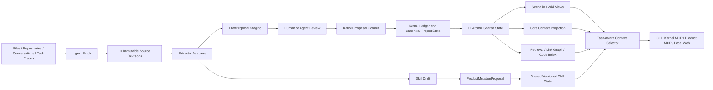

# Shared Mind Product Roadmap

| 항목 | 값 |
|---|---|
| 문서 버전 | 1.13.0 |
| 기준일 | 2026-08-15 |
| 상태 | DEV-029~095 완료 (hosted CI closeout 대기) |
| 대상 저장소 | `ArthurCore/shared-mind` |
| 구현 브랜치 | `agent/dev-095-scenario-grounding-integrity` |
| 참고 프로젝트 | `TencentCloud/TencentDB-Agent-Memory` |

## 1. 제품 목표

Shared Mind는 AI, 모델, 도구 또는 세션이 바뀌어도 하나의 프로젝트 상태를 유지한다.
Agent는 자기만의 프로젝트 기억을 소유하지 않는다. 모든 Agent는 동일한 Shared State를 관찰하고, 현재 작업에 필요한 context만 같은 규칙으로 선택해 받는다.

> **Project has state. Agents come and go.**

```text
Agent A memory != Agent B memory      # 금지
Shared Mind(A) == Shared Mind(B)      # 필수
Context(task A) != Context(task B)    # 허용
```

제품 흐름은 다음과 같다.

```text
문서 / 대화 / 코드 / 작업 trace
        ↓
immutable SourceRevision 등록
        ↓
검토 가능한 DraftProposal 또는 Skill Draft 생성
        ↓
사실·결정·질문·작업: kernel Proposal commit
절차적 Skill: ProductMutationProposal commit
        ↓
ONE Shared State 갱신
        ↓
Scenario / Core / Wiki / Retrieval / Code view 재생성
        ↓
ContextRequest(task/query/ref/budget)
        ↓
어떤 Agent에서도 결정적인 context로 작업 재개
```

## 2. Architecture Invariants

1. **One Shared State**: Agent, 모델, 역할, 세션별 canonical memory partition을 만들지 않는다.
2. **Same state, different view**: task가 다르면 context 세부 항목은 달라질 수 있지만 underlying state는 동일하다.
3. **Model-independent context**: 동일 state, `ContextRequest`, selector version, budget은 호출 모델과 무관하게 동일 context hash를 만든다.
4. **Shared Core Context**: 목적, active decision, critical constraint, open conflict/question, current work는 특정 Agent의 소유물이 아니다.
5. **Task-aware selection, not Agent loadout**: AgentProfile, fixed AssetBinding, role memory를 사용하지 않는다.
6. **No hidden memory fork**: 승인된 변경은 다음 모든 세션이 동일 state에서 관찰할 수 있어야 한다.
7. **Two explicit mutation boundaries**:
   - factual/project state는 kernel `Proposal`과 append-only ledger를 통과한다.
   - shared Skill state는 versioned/idempotent `ProductMutationProposal`, receipt, audit hash chain, replay를 통과한다.
8. **No direct mutation**: LLM, UI, MCP adapter가 kernel 또는 product DB를 직접 수정하지 않는다.
9. **Evidence authority**: active factual Claim은 검증 가능한 EvidenceLink를 가져야 한다.
10. **Conflict preservation**: 사실 모순은 양쪽 Claim을 남기고, stale non-commutative write는 적용하지 않는다.
11. **Disposable derived views**: Scenario, Core, Wiki, retrieval index, CodeGraph, context pack은 삭제 후 재생성 가능해야 한다.
12. **Local-first/provider-neutral**: 특정 LLM, embedding provider, vector DB 또는 TencentDB를 필수 의존성으로 만들지 않는다.

## 3. Tencent 아이디어 재검토 결과

| Tencent 개념 | 결정 | Shared Mind 적용 |
|---|---|---|
| Chat Memory 자동 추출 | 변형 채택 | 대화를 immutable source로 보존하고 DraftProposal 후보를 만든다. Agent별 Chat Memory는 만들지 않는다. |
| LLM-Wiki | 변형 채택 | canonical L1 객체를 연결하는 재생성 가능한 Scenario/Wiki view로 사용한다. |
| Skill | 변형 채택 | Agent 소유물이 아닌 shared versioned procedural state로 관리한다. |
| Agent Loadout | 제외 | `ContextRequest` 기반 Task-aware Context Selection으로 대체한다. |
| AgentProfile / role memory | 제외 | role은 선택 힌트일 수 있으나 memory partition key가 아니다. |
| Fixed Asset Binding | 제외 | 특정 Agent에 knowledge/Skill을 영구 장착하지 않는다. |
| Agent-restricted memory | 현재 제외 | local Shared Mind 내부에 Agent별 지식 단절을 만들지 않는다. 외부 공개 범위는 remote policy로 제어한다. |
| Cold Start import | 채택 | repo·문서·대화 ingest부터 첫 handoff까지 단일 흐름으로 제공한다. |
| Default Agent profile | 제외 | Agent identity 대신 project bootstrap policy와 기본 ContextRequest를 제공한다. |
| CodeGraph | 변형 채택 | source revision에서 재생성 가능한 비권위 index로 구현한다. |
| Memory Hub | 변형 채택 | Agent binding UI가 아니라 shared state review/control surface로 사용한다. |
| L0 Raw | 채택 | SourceRevision과 conversation/task trace가 evidence authority다. |
| L1 Atom | 채택 | Claim, Evidence, Decision, Question, WorkItem이 atomic shared state다. |
| L2 Scenario | 변형 채택 | 관련 L1 객체를 묶는 deterministic derived view다. |
| L3 Persona/Core | 별도 truth로 제외 | canonical state에서 `Core Context Projection`을 재생성한다. |
| Automatic Skill extraction | 변형 채택 | Skill Draft까지만 자동화하고 TESTED/APPROVED 승격은 검증을 요구한다. |
| Version/status/provenance | 채택 | 모든 canonical/product mutation과 derived artifact에 감사 가능한 provenance를 둔다. |
| Vector retrieval | 선택 채택 | FTS5/BM25가 기본이고 vector/RRF는 optional adapter다. |
| On-demand tools | 채택 | source span, Scenario, Skill, symbol, impact path를 필요할 때 읽는다. |
| Proxy automatic injection | 변형 채택 | 숨은 Agent memory가 아니라 명시적 ContextRequest 결과를 주입한다. |
| Team ACL/RBAC | 후순위 | 실제 multi-user 요구가 확인된 뒤 project/user access control로 검토한다. |

## 4. 구현 아키텍처



### 4.1 권위 구분

| 데이터 | 권위 | 저장/검증 |
|---|---|---|
| Source, Claim, Evidence, Conflict, Decision, Question, WorkItem | kernel canonical project state | kernel Proposal, ledger, receipt, replay |
| Skill | shared procedural product state | ProductMutationProposal, receipt, audit hash chain, version guard, replay |
| Draft | 비권위 staging | product store, review lifecycle |
| Scenario, Core, Wiki, retrieval, CodeGraph | 비권위 derived view | dependency digest, deterministic rebuild |
| Context pack | 요청별 projection | ContextRequest + selector version + budget |

## 5. Milestone 5 — Trusted Automatic Ingest

**상태: 완료**

- [x] **DEV-029 — IngestBatch와 manifest**: 파일·디렉터리·JSONL 대화 ingest 단위, fingerprint, 상태, 오류 기록.
- [x] **DEV-030 — Extractor interface**: deterministic extractor와 optional model-backed extractor 공통 계약.
- [x] **DEV-031 — DraftProposal staging store**: edit/reject/expire/commit lifecycle과 canonical DB 분리.
- [x] **DEV-032 — Review CLI/MCP**: ingest, extract, draft list/show/edit/reject/commit 흐름.
- [x] **DEV-033 — Extraction provenance**: extractor/model/prompt/parameter/source revision provenance.
- [x] **DEV-034 — Resource and policy boundary**: source scope, timeout, item/character/token cap, disclosure policy.
- [x] **DEV-035 — Extraction conformance/eval**: malformed input, invalid span, resume, unchanged re-import, duplicate, partial failure 시험.

**완료 결과**

- 수동 Proposal JSON 없이 source → Draft → review → commit → context 흐름이 동작한다.
- unchanged re-import의 duplicate는 0이다.
- extraction failure와 rejected Draft는 kernel ledger head를 전진시키지 않는다.
- committed factual Claim은 검증 가능한 source byte span을 가진다.

## 6. Milestone 6 — Scenario and Core Context Views

**상태: 완료**

- [x] **DEV-036 — DerivedArtifact contract**: level/scope/member/dependency digest/builder/provenance/lifecycle.
- [x] **DEV-037 — L1 normalization map**: Claim/Decision/Question/WorkItem 공통 atomic envelope.
- [x] **DEV-038 — Scenario builder**: project/feature/incident/decision thread 기준 deterministic grouping.
- [x] **DEV-039 — Core Context Projection**: purpose, active decisions, constraints, conflicts, questions, work를 canonical state에서 생성.
- [x] **DEV-040 — Dependency digest and invalidation**: 영향받은 derived artifact만 stale/rebuild.
- [x] **DEV-041 — Layer-aware context selection**: Core/Scenario bootstrap 후 task 관련 L1/L0 추가.
- [x] **DEV-042 — Drill-down projection**: derived view에서 object/evidence/receipt/source revision 추적.

**완료 결과**

- Core는 별도 authoritative fact를 생성하지 않는다.
- open conflict가 관련된 view는 양쪽 Claim과 conflict ID를 표시한다.
- 동일 state/builder version은 동일 output hash를 만든다.
- 근거 요구 시 L1/L0 source span까지 내려갈 수 있다.

## 7. Milestone 7 — Shared Versioned Skill State

**상태: 완료**

- [x] **DEV-043 — SkillRecord contract**: purpose, trigger, preconditions, steps, resources, outputs, validation, provenance, status.
- [x] **DEV-044 — Skill mutation proposal**: create/import/revise/promote/deprecate, idempotency, expected state hash와 version guard.
- [x] **DEV-045 — Task trace importer**: conversation/tool/task trace에서 Skill Draft 생성.
- [x] **DEV-046 — Skill review/promotion**: DRAFT → TESTED → APPROVED → DEPRECATED lifecycle.
- [x] **DEV-047 — Portable Skill package**: resource fingerprint와 validation metadata를 보존하는 export/import.
- [x] **DEV-048 — Skill retrieval/execution eval**: task relevance 선택, validation 실행, reuse outcome 측정.

**완료 결과**

- Skill은 Agent별 복사본이 아니라 하나의 shared identity/version을 참조한다.
- 검증되지 않은 Skill은 APPROVED로 승격되지 않는다.
- stale Skill update는 product transaction conflict로 거부된다.
- product receipts와 audit hash chain을 재생해 동일 Skill state hash를 검증한다.
- kernel schema는 `1.3.0`을 유지하며 Skill history가 frozen kernel ledger를 소급 변경하지 않는다.

## 8. Milestone 8 — One Shared State Context Routing

**상태: 완료**

- [x] **DEV-049 — ContextRequest contract**: task, purpose, query, ref, depth, budget, optional hints.
- [x] **DEV-050 — Shared Core Context policy**: 공통으로 우선 포함할 project state 규칙.
- [x] **DEV-051 — Task relevance selector**: task/query/ref와 L1/Scenario/Skill/index stable ranking.
- [x] **DEV-052 — Budgeted context assembler**: Core + Task Context + drill-down pointer, omission metadata.
- [x] **DEV-053 — CLI/service/MCP integration**: `--task`, `--query`, `--ref`, `--budget-*` 동일 의미.
- [x] **DEV-054 — Selection trace/parity eval**: 포함·제외 이유와 cross-client context hash parity.

**완료 결과**

- Agent별 canonical table, profile memory, fixed binding이 없다.
- 동일 state/request/version/budget은 호출 Agent와 무관하게 동일 context hash를 만든다.
- task가 달라져도 Core Context와 underlying state는 공유된다.
- budget accounting과 included/omitted reason이 결과에 남는다.

## 9. Milestone 9 — Zero-Relearning Cold Start

**상태: 완료**

- [x] **DEV-055 — Bulk document importer**: repo docs, Markdown, text, code의 manifest 기반 등록.
- [x] **DEV-056 — Conversation session importer**: Codex/Claude/general JSONL와 original timestamp 보존.
- [x] **DEV-057 — Default project bootstrap policy**: generic Core Context와 ContextRequest preset.
- [x] **DEV-058 — Cold-start build report**: imported/unchanged/failed/draft/committed/stale/conflict 집계.
- [x] **DEV-059 — First handoff pack**: purpose, decisions, questions, work, source map, next action.
- [x] **DEV-060 — Single-command workflow**: ingest → extract → commit policy → build → context.

**완료 결과**

- 새 workspace에 repo·문서·conversation export를 넣고 첫 handoff를 생성한다.
- 재실행은 변경분만 처리한다.
- build report 수치가 실제 store 상태와 일치한다.
- 한 client가 만든 state를 다른 client가 동일 context 규칙으로 복원한다.

## 10. Milestone 10 — Retrieval, Wiki, and Code Understanding

**상태: 완료**

- [x] **DEV-061 — FTS5/BM25 retrieval**: local lexical search, filters, stable ranking, fallback.
- [x] **DEV-062 — Optional vector/RRF adapter**: optional embedding result와 lexical result 결합.
- [x] **DEV-063 — Wiki link graph**: Scenario/source/Claim/Decision/Skill 관계 graph.
- [x] **DEV-064 — Code index v1**: Python file/symbol/definition/reference index.
- [x] **DEV-065 — CodeGraph v2**: caller/callee와 change-impact path.
- [x] **DEV-066 — On-demand tool protocol**: capability discovery와 source/span/scenario/skill/symbol/impact 조회.
- [x] **DEV-067 — Retrieval quality eval**: relevance, conflict exposure, evidence traceability, cost, latency.

**완료 결과**

- lexical-only mode가 dependency-free 기본값이다.
- optional vector adapter가 없어도 correctness가 유지된다.
- 검색 결과는 provenance와 source/evidence pointer를 보존한다.
- index/graph 삭제 후 source와 shared state에서 재생성할 수 있다.

## 11. Milestone 11 — Governance and Control Surface

**상태: 완료**

- [x] **DEV-068 — Unified catalog**: atomic state, derived view, Skill, Wiki, Code index metadata 조회.
- [x] **DEV-069 — Lifecycle/review attribution**: status, proposer, reviewer, provenance.
- [x] **DEV-070 — Review queues**: Draft, stale artifact, conflict, Skill promotion queue.
- [x] **DEV-071 — Local web control surface**: loopback-only UI/API와 service boundary 재사용.
- [x] **DEV-072 — Backup/export/migration**: kernel, sources, product state, metadata의 검증 가능한 package.

**완료 결과**

- UI가 DB를 직접 수정하지 않는다.
- 상세 조회에서 source, derivation, version, lifecycle, proposer/reviewer를 확인한다.
- Agent별 binding 관리 화면은 존재하지 않는다.
- backup/restore 후 kernel state root와 product state hash를 검증한다.

## 12. Milestone 12 — Continuous Compounding and Product Evaluation

**상태: 완료**

- [x] **DEV-073 — Post-task capture**: fact/decision/question/work/Skill 후보를 staging에 생성.
- [x] **DEV-074 — Incremental consolidation**: 변경 dependency의 view/index만 갱신.
- [x] **DEV-075 — Usage and feedback events**: 조회·사용·실패 telemetry.
- [x] **DEV-076 — Memory quality metrics**: evidence validity, conflict recall, staleness, duplicate, provenance.
- [x] **DEV-077 — Context routing metrics**: relevance, irrelevant context, Core preservation, parity, cost.
- [x] **DEV-078 — Skill reuse benchmark**: 성공률, rework, turns, validation 비교.
- [x] **DEV-079 — Cold-start benchmark**: manual explanation baseline 대비 정확도·비용·연속성 비교.

**완료 결과**

- quality와 efficiency를 별도 지표로 판정한다.
- 자동 ingest/consolidation을 꺼도 kernel 기능은 유지된다.
- compounding loop가 kernel/product mutation boundary를 우회하지 않는다.
- 반복 가능한 fixture와 product evaluation artifact를 제공한다.

## 13. Milestone 13 — Self-Dogfooding Continuity Evaluation

이 milestone은 DEV-029~079 완료 기준선을 유지한 채 실제 Shared Mind workspace
`../shared-mind-memory` 하나를 Codex, Claude, GPT와 모든 새 세션이 함께 사용하는
단계다. Agent별 canonical memory, AgentProfile, Agent Loadout, Fixed Asset Binding은
계속 금지한다.

### DEV-080 — Shared Mind Self-Dogfooding

**상태: DONE**

- 실제 external workspace에서 self cold-start를 수행했다.
- directive pollution과 incremental Scenario verification 결함을 RED→GREEN으로 수정했다.
- Python 3.13.2 전체 391 tests / 0 failures / branch coverage 82%와
  `PRODUCT_INTEGRITY_VALID`를 기록했다.

### DEV-081 — Real Session Capture

**상태: DONE**

- versioned, immutable task trace에 TASK/TOOL/RESULT/DECISION/FAILURE/TEST event를 보존한다.
- 동일 trace 재전송은 canonical history와 audit를 늘리지 않고, 같은 trace ID의 다른
  bytes는 fail closed한다.
- malformed trace는 file/source/receipt를 만들기 전에 거부한다.
- source 등록 뒤 실패한 retry는 동일 SourceRevision을 재사용한다.
- 입력 timestamp와 event 순서를 그대로 보존하고 다음 새 세션에서 검색 및 source
  evidence drill-down이 가능해야 한다.
- capture는 kernel Proposal source-registration boundary를 우회하지 않는다.

완료 evidence는 [`docs/testing/dev-081-session-capture.tdd.md`](docs/testing/dev-081-session-capture.tdd.md)에
기록했다. strict capture를 실제 `../shared-mind-memory`에 적용했고, 다음 fresh
process에서 검색·source span·task-aware context로 복원했다.

### DEV-082~086

- [x] **DEV-082 — Zero-Relearning Evaluation — DONE**: fresh session의 continuity accuracy,
  decision/open-question/conflict recall, evidence traceability와 productive-action 시간을 자동 측정한다.
- [x] **DEV-083 — Memory Pollution / Wrong Memory Evaluation — DONE**: duplicate, irrelevant,
  stale, wrong, confidently wrong memory를 서로 구분해 fail closed한다.
- [x] **DEV-084 — Memory Lifecycle — DONE**: current, stale, superseded, completed를 구분하면서
  non-current record의 history를 보존한다.
- [x] **DEV-085 — Conflict Resolution Workflow — DONE**: 원 conflicting Claims, episode/member
  digest, selected/rejected partition, rationale와 evidence를 보존한다.
- [x] **DEV-086 — Context Quality Benchmark — DONE**: relevant recall, missing critical memory,
  irrelevant context, evidence traceability, bytes/tokens와 time-to-action을 측정한다.

구현 계약과 acceptance는
[`docs/DEV-082-086-continuity-evaluations.md`](docs/DEV-082-086-continuity-evaluations.md),
RED/GREEN·전체 회귀·실제 dogfooding evidence는
[`docs/testing/dev-082-086-continuity-evaluations.tdd.md`](docs/testing/dev-082-086-continuity-evaluations.tdd.md)에
기록한다. 평가 결과는 immutable evidence일 뿐 canonical truth가 아니다.

### DEV-087 — Paired Context Reduction Evaluation

**상태: DONE**

- 같은 canonical state, task, query, references에서 full baseline과 compact
  candidate를 쌍으로 비교한다.
- 두 context hash와 state root를 검증하고 DEV-082 zero-relearning 품질을 양쪽에
  적용한다.
- bytes, counted tokens, time-to-productive-action 감소율을 unclamped actual 값으로
  기록한다.
- 핵심 recall/evidence가 낮아지거나 wrong/missing memory가 늘면 크기가 작아도 실패한다.
- Python/CLI/MCP와 immutable runner/report schema가 동일한 결과를 반환해야 한다.

계약은 [`docs/DEV-087-context-reduction-evaluation.md`](docs/DEV-087-context-reduction-evaluation.md),
RED/GREEN과 실제 paired measurement는
[`docs/testing/dev-087-context-reduction-evaluation.tdd.md`](docs/testing/dev-087-context-reduction-evaluation.tdd.md)에
기록한다. 실제 paired evidence와 전체 회귀를 통과한 뒤 기존 OpenQuestion을
source-backed answer로 종료했다.

### DEV-088 — Literal-safe Retrieval Queries

**상태: DONE**

- task ID, version, FTS operator, quote, parenthesis, punctuation과 Unicode를
  advanced FTS syntax가 아닌 literal user text로 처리한다.
- SQLite `unicode61` 경계에 맞춘 공통 token sequence를 FTS5와 dependency-free
  fallback이 함께 사용한다.
- punctuation-only query는 error가 아니라 빈 결과를 반환한다.
- Python/CLI/product MCP 결과에 `retrieval-index@2`를 노출하고 동일한 ordered
  result ID를 반환한다.
- 실제 `../shared-mind-memory`에서 `DEV-088`, `schema 1.3`, operator/punctuation
  검색을 재현하고 consolidate/verify까지 완료한다.

계약은 [`docs/DEV-088-literal-safe-retrieval.md`](docs/DEV-088-literal-safe-retrieval.md),
RED/GREEN과 self-dogfooding evidence는
[`docs/testing/dev-088-literal-safe-retrieval.tdd.md`](docs/testing/dev-088-literal-safe-retrieval.tdd.md)에
기록한다.

### DEV-089 — Fresh Schema 1.3 Benchmark Certification

**상태: DONE**

- fresh current-schema fixture 생성, 전체 ledger 검증, explicit file replay,
  5 warmup/50 sample context 측정을 한 명령으로 수행한다.
- strict `context-benchmark-certification@1` schema, portable database hash/size,
  result self-hash와 atomic no-clobber write를 사용한다.
- historical schema fixture, invalid verifier, replay mismatch와 result drift는
  fail closed한다.
- fresh schema 1.3 `history-heavy`와 `hot-active` 각각 ledger/receipt 100,000건,
  verifier 0 errors, exact replay parity를 확인한다.
- context p95는 history-heavy 4.7165ms/950 bytes, hot-active
  1.6767885s/2,928 bytes로 둘 다 2초 목표를 통과한다.

계약은
[`docs/DEV-089-schema13-benchmark-certification.md`](docs/DEV-089-schema13-benchmark-certification.md),
RED/GREEN은
[`docs/testing/dev-089-schema13-benchmark-certification.tdd.md`](docs/testing/dev-089-schema13-benchmark-certification.tdd.md),
측정 evidence는
[`benchmarks/results/dev-089-schema13-2026-08-15.md`](benchmarks/results/dev-089-schema13-2026-08-15.md)에
기록한다.

### DEV-090 — Streaming Benchmark Evidence Hashing

**상태: DONE**

- certification source/replay SHA-256을 whole-file allocation 대신 고정 1MiB
  chunk로 계산한다.
- 같은 open descriptor의 dev/inode/size/mtime/ctime과 byte count를 전후 비교해
  hashing 중 변경을 fail closed한다.
- directory/special/unreadable input은 stable reason code로 거부한다.
- 보존된 527,572,992-byte DEV-089 source/replay의 SHA/size가 checked-in
  certification과 exact parity임을 확인했다.
- 두 파일 first pass의 Python peak allocation은 약 2.11MiB, max RSS는 약
  39.5MiB로 파일 크기에 비례하는 allocation을 제거했다.

계약은
[`docs/DEV-090-streaming-benchmark-evidence.md`](docs/DEV-090-streaming-benchmark-evidence.md),
RED/GREEN과 actual-file evidence는
[`docs/testing/dev-090-streaming-benchmark-evidence.tdd.md`](docs/testing/dev-090-streaming-benchmark-evidence.tdd.md)에
기록한다.

### DEV-091 — Unclamped Live Evaluation Reductions

**상태: DONE**

- live comparison 기본 계약을 `product-continuity-live-comparison@2`로 올린다.
- context가 baseline보다 비싸거나 느릴 때 음수 감소율을 실제 값으로 보존한다.
- explicit `@1` 경로는 기존 clamp와 checked-in artifact bytes를 그대로 재현한다.
- unknown version과 boolean/0/음수/non-finite metric은 stable error로 fail closed한다.
- nested comparison version에 따라 live-summary schema가 clamped/unclamped 값을
  엄격하게 검증한다.

계약은
[`docs/DEV-091-unclamped-live-reduction.md`](docs/DEV-091-unclamped-live-reduction.md),
RED/GREEN은
[`docs/testing/dev-091-unclamped-live-reduction.tdd.md`](docs/testing/dev-091-unclamped-live-reduction.tdd.md)에
기록한다.

### DEV-092 — Unclamped Offline Evaluation Reductions

**상태: DONE**

- product-continuity scorer 기본 출력을 `product-continuity-report@2`로 올린다.
- offline context가 baseline보다 비싸거나 느릴 때 signed 감소율을 보존한다.
- explicit report `@1`은 기존 clamp와 v1 schema를 그대로 재현한다.
- live-summary nested report도 version별 reduction 의미를 strict하게 검증한다.
- unknown version과 비정상 metric은 stable error로 fail closed한다.

계약은
[`docs/DEV-092-unclamped-offline-reduction.md`](docs/DEV-092-unclamped-offline-reduction.md),
RED/GREEN은
[`docs/testing/dev-092-unclamped-offline-reduction.tdd.md`](docs/testing/dev-092-unclamped-offline-reduction.tdd.md)에
기록한다.

### DEV-093 — Evaluation Input Integrity

**상태: DONE (local gates)**

- public offline scorer가 별도 schema 호출 없이도 metrics version, exact shape,
  fixed threshold, quality fraction을 검증한다.
- empty quality map의 vacuous `all()` 통과를 차단한다.
- live comparison은 nested report version, boolean `passed`, bounded score와
  finite quality fraction을 직접 검증한다.
- malformed input은 stable reason prefix로 fail closed하고 valid/historical
  report 결과는 유지한다.

계약은
[`docs/DEV-093-evaluation-input-integrity.md`](docs/DEV-093-evaluation-input-integrity.md),
RED/GREEN은
[`docs/testing/dev-093-evaluation-input-integrity.tdd.md`](docs/testing/dev-093-evaluation-input-integrity.tdd.md)에
기록한다.

### DEV-094 — Scoring Contract Integrity

**상태: DONE (local gates)**

- evaluator-side scoring object의 exact field set과 typed constants를 scorer
  내부에서 직접 검증한다.
- 100-point maximum/pass threshold, `1.0` quality threshold, six dimension
  weights, three positive penalties의 drift를 허용하지 않는다.
- boolean/NaN/누락/추가/약화 입력은 `INVALID_SCORING_CONTRACT`로 fail closed한다.
- valid golden report와 explicit historical report behavior는 유지한다.

계약은
[`docs/DEV-094-scoring-contract-integrity.md`](docs/DEV-094-scoring-contract-integrity.md),
RED/GREEN은
[`docs/testing/dev-094-scoring-contract-integrity.tdd.md`](docs/testing/dev-094-scoring-contract-integrity.tdd.md)에
기록한다.

### DEV-095 — Scenario Grounding Integrity

**상태: DONE (local gates)**

- scenario@1 version, exact shape, schema pins를 scorer 내부에서 검증한다.
- context/expected response의 scenario ID, purpose, six non-vacuous dimensions를
  고정한다.
- decision, claim/evidence, conflict/member, question, work state가 context와
  semantic하게 일치해야 한다.
- vacuous/ungrounded fixture는 `INVALID_SCENARIO_CONTRACT`로 fail closed한다.

계약은
[`docs/DEV-095-scenario-grounding-integrity.md`](docs/DEV-095-scenario-grounding-integrity.md),
RED/GREEN은
[`docs/testing/dev-095-scenario-grounding-integrity.tdd.md`](docs/testing/dev-095-scenario-grounding-integrity.tdd.md)에
기록한다.

## 14. 구현된 인터페이스

```text
shared-mind                 Kernel CLI와 task-aware context compatibility path
shared-mind-mcp             Optional kernel MCP
shared-mind-product         Ingest, Draft, views, Skill, retrieval, governance
shared-mind-product-mcp     분리된 product MCP
shared-mind-web             Loopback-only local control surface
```

주요 구현 모듈:

```text
src/shared_mind/product.py
src/shared_mind/product_store.py
src/shared_mind/product_contract.py
src/shared_mind/product_ingest.py
src/shared_mind/memory_views.py
src/shared_mind/retrieval.py
src/shared_mind/skills.py
src/shared_mind/product_mcp_server.py
src/shared_mind/web_control.py
```

## 15. 검증 기준선

### 15.1 완료된 로컬 검증

- kernel contract validator 통과.
- product contract validator 통과: **10 positive fixtures + 14 negative fixtures**.
- DEV-080 완료 전체 회귀 기준선: **391 tests, 0 failures, branch coverage 82%**.
- DEV-081 완료 전체 회귀: **401 tests, 0 failures, branch coverage 82%**.
- DEV-082~086 완료 전체 회귀: **417 tests, 0 failures, branch coverage 82%**.
- DEV-082~086 targeted continuity evaluation: **15 tests 통과**.
- DEV-087 구현 전체 회귀: **428 tests, 0 failures, branch coverage 83%**.
- DEV-087 paired context reduction: **11 tests**, 기존 연속성 포함 **26 tests 통과**.
- DEV-088 구현 전체 회귀: **432 tests, 0 failures, branch coverage 83%**.
- DEV-088 literal-safe retrieval: **4 tests**, 검색/인터페이스 회귀 포함
  **33 tests 통과**.
- DEV-089 benchmark certification: strict schema/실패 경계/체크인 artifact 포함
  **7 tests**, projection/benchmark 회귀 포함 **28 tests 통과**.
- DEV-089 fresh schema 1.3 100k: 두 profile 모두 ledger/receipt 1:1,
  verifier/replay exact parity와 50-sample p95 2초 이내 통과.
- DEV-089 완료 전체 회귀: **439 tests, 0 failures, branch coverage 83%**.
- DEV-090 streaming evidence hashing: **3 RED→GREEN tests**, benchmark/projection
  회귀 포함 **31 tests 통과**, real 503MiB source/replay SHA/size exact parity.
- DEV-090 완료 전체 회귀: **442 tests, 0 failures, branch coverage 83%**.
- DEV-091 unclamped live reduction: **4 RED→GREEN tests**, product-continuity
  회귀 포함 **18 tests 통과**.
- DEV-091 완료 전체 회귀: **446 tests, 0 failures, branch coverage 83%**.
- DEV-092 unclamped offline reduction: **4 RED tests**, final focused
  **5 tests**, offline/live product-continuity 회귀 포함 **23 tests 통과**.
- DEV-092 완료 전체 회귀: **451 tests, 0 failures, branch coverage 83%**.
- DEV-093 evaluation input integrity: **6 RED→GREEN tests**, continuity
  evaluation 회귀 포함 **29 tests 통과**.
- DEV-093 완료 전체 회귀: **457 tests, 0 failures, branch coverage 83%**.
- DEV-094 scoring contract integrity: **6 RED→GREEN tests**, product-continuity
  evaluation 회귀 포함 **35 tests 통과**.
- DEV-094 완료 전체 회귀: **463 tests, 0 failures, branch coverage 83%**.
- DEV-095 scenario grounding integrity: **7 RED→GREEN tests**, evaluation
  회귀 포함 **33 tests 통과**.
- DEV-095 완료 전체 회귀: **470 tests, 0 failures, branch coverage 83%**.
- 제품 중심 회귀군: **46 tests 통과**.
- 별도 확장 실행에서 discovery된 **388 tests가 모두 test assertion을 통과**했으나, 동시에 실행된 두 coverage runner가 `.coverage.*`를 상호 삭제해 해당 실행의 합산 coverage 수치는 증거로 사용하지 않는다.
- Ruff가 원격 quality job에서 보고한 unused import/local 11건 제거.
- compileall 통과.
- wheel build와 metadata/content 검사 통과.
- wheel에 product modules, product contract/fixtures와 5개 console entrypoint 포함 확인.
- macOS와 Ubuntu deterministic subsets 통과; Windows에서도 deterministic test steps 통과.
- process-heavy 테스트가 일반 병렬 worker와 SQLite/CPU를 경쟁하지 않도록 coverage runner에 exclusive lane 추가.
- durability barrier ready file을 atomic rename으로 공개해 부분 JSON 관찰 race 제거.

### 15.2 Hosted GitHub Actions 상태

Actions runner access가 복구됐다. PR #4의 구현 head
`b52b7257a5b8b11f1949fe6272217d67970f7a16`에서
[GitHub Actions run 31857557825](https://github.com/ArthurCore/shared-mind/actions/runs/31857557825)가
성공했고, 최종 documentation head `ac90490a37393f8d3065ea926acd3b40dbf922d6`도
[run 31859364496](https://github.com/ArthurCore/shared-mind/actions/runs/31859364496)에서
아래 8개 job을 모두 통과한 뒤 main에 병합됐다. DEV-082~086 branch는 PR #5
head `97d5811cf9ac852f076f76e5cff04f6d097e9567`의
[run 31866492746](https://github.com/ArthurCore/shared-mind/actions/runs/31866492746)에서
같은 8개 job을 통과하고 merge commit
`d358912c2fbd9dfcc22f1f74883319e6db59f856`로 main에 병합됐다. 위
417-test/82% 수치는 병합 전 로컬 Python 3.13 검증 결과다.

1. Python 3.11 contract + full branch coverage: **PASS**.
2. Python 3.12 contract + full branch coverage: **PASS**.
3. Python 3.13 contract + full branch coverage: **PASS**.
4. Ubuntu determinism: **PASS**.
5. macOS determinism: **PASS**.
6. Windows determinism: **PASS**.
7. Compile/Ruff/mypy/dependency audit/Bandit: **PASS**.
8. Fresh wheel install and all entrypoint smoke: **PASS**.

기존 billing/spending-limit 표시는 해소된 외부 runner-access incident였으며 현재
구현 또는 merge blocker가 아니다.

DEV-087은 local regression/dogfooding과 Shared Mind closeout까지 완료했다. PR #6
구현 head `58b6fb1b0a9a69f1e9cfe2d18da9405a82b0669b`의
[run 31867443975](https://github.com/ArthurCore/shared-mind/actions/runs/31867443975)는
위 8개 job을 모두 통과했고 commit check 19개도 모두 성공했다.

DEV-088은 432-test/83% local regression과 real Shared Mind dogfooding을
완료했다. PR #7 source/test/documentation head
`3db636a4579925a9badce97d189ce6669fb7ddd4`의
[run 31869424469](https://github.com/ArthurCore/shared-mind/actions/runs/31869424469)은
Python 3.11~3.13 coverage, 3-OS determinism, quality/security, fresh wheel의
8개 job을 모두 통과했다. 같은 head의 push
[run 31869406046](https://github.com/ArthurCore/shared-mind/actions/runs/31869406046)도
8개 job을 모두 통과했다.

DEV-089은 fresh schema 1.3 두 profile의 100k one-command certification과
439-test/83% local regression을 완료했다. PR #8 첫 documentation head의
[run 31871756255](https://github.com/ArthurCore/shared-mind/actions/runs/31871756255)와
동일 source head push
[run 31871738857](https://github.com/ArthurCore/shared-mind/actions/runs/31871738857)은
각각 Python 3.11~3.13 coverage, 3-OS determinism, quality/security, fresh wheel
8개 job을 모두 통과했다. CodeQL
[run 31871755515](https://github.com/ArthurCore/shared-mind/actions/runs/31871755515)의
actions/python 분석도 통과했다.

DEV-090은 bounded streaming evidence hash, 503MiB real-file parity,
442-test/83% local regression과 Shared Mind closeout을 완료했다. PR #9 첫 head의
[run 31872311320](https://github.com/ArthurCore/shared-mind/actions/runs/31872311320)과
push [run 31872301244](https://github.com/ArthurCore/shared-mind/actions/runs/31872301244)는
각각 8개 CI job을 모두 통과했다. CodeQL
[run 31872310697](https://github.com/ArthurCore/shared-mind/actions/runs/31872310697)의
actions/python 분석도 통과했다.

DEV-091은 signed live comparison `@2`, explicit historical `@1` compatibility,
446-test/83% local regression과 Shared Mind closeout을 완료했다. PR #10 source,
test, documentation head `13834d9835a8bb552e89339e05e638925625dc76`의
[run 31872892729](https://github.com/ArthurCore/shared-mind/actions/runs/31872892729)은
Python 3.11~3.13 coverage, 3-OS determinism, quality/security, fresh wheel의
8개 job을 모두 통과했다.

DEV-092는 signed offline report `@2`, explicit historical `@1` compatibility,
451-test/83% local regression과 Shared Mind closeout을 완료했다. PR #11 source,
test, documentation head `534db0d74d1520d4c8557b3462e4ff7fe44ef680`의
[run 31873428269](https://github.com/ArthurCore/shared-mind/actions/runs/31873428269)은
Python 3.11~3.13 coverage, 3-OS determinism, quality/security, fresh wheel의
8개 job을 모두 통과했다.

DEV-093은 public evaluation helper의 malformed version/shape/quality bypass를
fail closed하고 457-test/83% local regression과 Shared Mind closeout을 완료했다.
PR #12 source, test, documentation head
`4f64e72e443a55043d56bf465d748d3a467e94f0`의
[run 31873909032](https://github.com/ArthurCore/shared-mind/actions/runs/31873909032)은
Python 3.11~3.13 coverage, 3-OS determinism, quality/security, fresh wheel의
8개 job을 모두 통과했다.

DEV-094는 evaluator-side scoring weights, penalties, pass/quality thresholds를
exact typed constants로 고정해 scoring-policy drift를 fail closed하고
463-test/83% local regression과 Shared Mind closeout을 완료했다. PR #13 첫
source/test/documentation head `3051f9986ac6e867cb6ef4949a609fc161e3e616`의
[run 31874440698](https://github.com/ArthurCore/shared-mind/actions/runs/31874440698)은
Python 3.11~3.13 coverage, 3-OS determinism, quality/security, fresh wheel의
8개 job을 모두 통과했다.

DEV-095는 vacuous 또는 ungrounded scenario fixture가 100점을 받는 경로를
차단하고 470-test/83% local regression을 완료했다. Shared Mind closeout과
hosted CI 근거는 PR 완료 시 이 절에 추가한다.

## 16. Definition of Done

DEV 작업은 다음 조건을 만족할 때 완료로 본다.

- 관련 contract/schema/version 영향이 명시돼 있다.
- factual/project mutation은 kernel Proposal만 사용한다.
- Skill mutation은 ProductMutationProposal만 사용한다.
- accepted/rejected/idempotent/stale/replay 경로가 시험된다.
- model-backed 결과는 extractor/model/prompt/input provenance를 보존한다.
- derived artifact는 dependency digest와 재생성 방법을 가진다.
- open conflict와 evidence traceability가 view/context에서 유지된다.
- local deterministic mode가 존재한다.
- CLI/Python/MCP 의미가 일치한다.
- failure는 stable machine-readable reason code를 반환한다.
- README/SRS/architecture/roadmap이 실제 구현과 일치한다.

## 17. 현재 성공 지표

| 지표 | 기준 |
|---|---|
| Agent/session-specific canonical partition | 0 |
| canonical direct-write bypass | 0 |
| silent overwrite | 0 |
| committed factual Claim evidence validity | 100% |
| open conflict exposure | 100% |
| unchanged re-import duplicate | 0 |
| derived artifact provenance completeness | 100% |
| deterministic rebuild | 동일 state/version에서 동일 hash |
| manual Proposal JSON dependency | 기본 ingest 흐름에서 제거 |
| unreviewed Skill auto-promotion | 0 |
| same state/request/version/budget cross-client parity | 동일 context hash |

## 18. 이후 범위

DEV-080~088은 완료됐다. 다음 항목은 이 단계 이후에도 현재 제품 범위에 포함하지
않는다.

- multi-tenant cloud service와 distributed database.
- 조직/팀 RBAC와 외부 identity provider.
- 모든 언어의 범용 CodeGraph.
- mandatory vector DB 또는 mandatory embedding provider.
- LLM이 사실 진위를 자동 확정하는 curator.
- 검토 없는 Skill 자동 승격.
- Agent별 memory/loadout/binding.
- TencentDB 또는 특정 vendor runtime 종속.

---

최종 판단 기준은 기능 수가 아니다.

> **다음 AI가 프로젝트를 다시 설명받지 않고 같은 상태에서 일을 이어가며, 그 편의성을 얻는 과정에서 근거·충돌·결정·변경 이력이 손실되지 않는가?**
