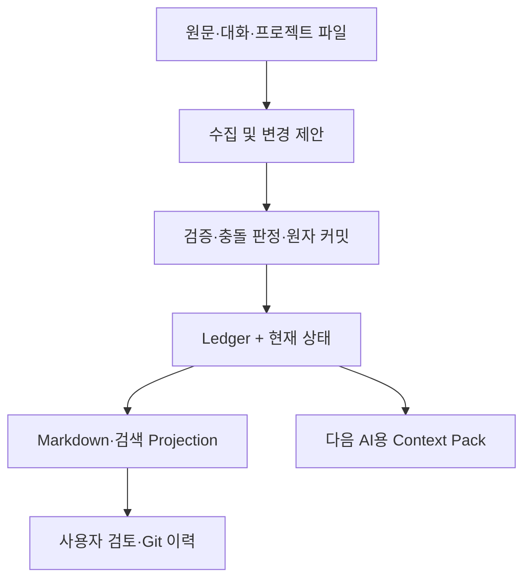

# Shared Mind 소프트웨어 요구사항 명세서 (SRS)

| 항목 | 값 |
|---|---|
| 문서 버전 | 1.1.0 |
| 기준일 | 2026-08-11 |
| 상태 | 구현 동기화 기준선(Implemented Baseline) |
| 대상 저장소 | `ArthurCore/shared-mind` |
| 구현 기준선 | 시작 `3c3cdf0`, 현재 `main`의 로컬 계약·conformance suite |
| 주 독자 | 제품 책임자, 개발자, 코딩 에이전트, 검토자 |

## 1. 문서의 목적

이 문서는 Shared Mind의 목적, 지금까지의 연구와 실험, 설계가 변화한 이유, 현재 구현 상태, 앞으로 개발할 기능과 합격 기준을 하나의 기준선으로 정의한다.

이 문서의 최우선 목적은 다음 두 가지가 다시 뒤섞이지 않도록 하는 것이다.

1. **제품 목적:** AI나 대화가 바뀌어도 사용자의 자료, 생각, 결정, 질문, 진행 상황을 다음 AI가 이어받게 한다.
2. **기술적 안전장치:** 여러 AI가 같은 기억을 수정할 때 근거 손실, 오래된 변경, 조용한 덮어쓰기를 막는다.

기술적 안전장치는 제품 목적을 달성하기 위한 기반이며 제품 그 자체가 아니다. 이후 구현은 이 우선순위를 따른다.

## 2. 한 문장 제품 정의

> **Shared Mind는 사용자가 소유한 자료·사실·생각·결정·질문·할 일을 연결해 보존하고, AI 또는 대화 세션이 바뀌어도 다음 AI가 현재 상태와 근거를 읽고 바로 이어서 일할 수 있게 하는 로컬 우선 외부 기억이다.**

## 3. 해결하려는 문제

현재의 대화형 AI 사용에는 다음 단절이 반복된다.

- 새 대화나 다른 AI를 사용할 때 프로젝트를 처음부터 다시 설명해야 한다.
- 결정의 결론만 남고, 왜 그렇게 결정했는지와 어떤 대안을 버렸는지가 사라진다.
- 자료별 요약은 쌓이지만 여러 자료 사이의 개념, 주장, 근거, 모순이 통합되지 않는다.
- 한 AI가 파악한 맥락을 다른 AI가 그대로 이어받지 못한다.
- 여러 AI가 같은 지식을 수정하면 최신 변경이 이전 내용을 조용히 덮어쓸 수 있다.
- 오래된 변경 제안과 세계에 대한 상충 주장이 모두 단순한 “충돌”로 취급되어 올바른 대응을 하기 어렵다.
- 특정 서비스 내부 메모리에 의존하면 사용자가 지식을 직접 검사, 이동, 복구하기 어렵다.

Shared Mind는 이를 “더 긴 채팅 기록”으로 해결하지 않는다. 프로젝트에 필요한 상태를 명시적인 객체와 변경 이력으로 보존하고, 사람이 읽을 수 있는 형태로 다시 보여주는 방식으로 해결한다.

## 4. 제품 가치와 우선순위

### 4.1 핵심 가치

1. **연속성:** 새 세션이 현재 상황을 빠르게 복원한다.
2. **공유성:** Codex, Claude Code 등 서로 다른 에이전트가 같은 기억을 읽고 제안할 수 있다.
3. **누적성:** 대화가 일회성 답변이 아니라 연결된 장기 지식이 된다.
4. **추적성:** 주장과 결정의 근거, 변경자, 변경 시점, 이전 상태를 확인할 수 있다.
5. **사용자 소유:** 로컬 데이터와 공개 형식으로 보관하고 특정 모델이나 서비스에 종속되지 않는다.
6. **안전한 협업:** 모순은 보존하고, 오래된 변경은 거부하며, 실패 원인을 구조화해 돌려준다.

### 4.2 고정 우선순위

| 순위 | 목표 | 판단 기준 |
|---:|---|---|
| 1 | 기억하고 이어가기 | 다음 AI가 재설명 없이 현재 작업을 시작할 수 있는가 |
| 2 | 여러 AI가 공유하기 | 에이전트가 달라도 같은 상태와 근거를 읽는가 |
| 3 | 안전하게 함께 수정하기 | 근거·모순·오래된 제안을 조용히 덮어쓰지 않는가 |
| 4 | 검색·시각화·자동화 확장 | 위 세 목표를 훼손하지 않고 사용성을 높이는가 |

## 5. 프로젝트의 출발점과 변화 과정

### 5.1 1단계 — Personal LLM Wiki 구상

프로젝트는 Andrej Karpathy의 [LLM Wiki 아이디어](https://gist.github.com/karpathy/442a6bf555914893e9891c11519de94f)에서 출발했다. 초기 구상은 다음과 같았다.

- Markdown + 파일시스템 + Git + 코딩 에이전트 + `ripgrep` + 작은 Python 도구로 시작한다.
- 원문(raw sources)을 보존한다.
- 자료마다 요약 파일만 만드는 것이 아니라 개념, 엔터티, 주장, 관계를 자료 사이에서 통합한다.
- 사람이 직접 읽을 수 있고, AI도 쉽게 검색할 수 있어야 한다.
- 데이터베이스, 임베딩, 복잡한 UI는 실제 필요가 확인된 뒤에 도입한다.

초기 사용 흐름은 **넣는다 → 연결한다 → 다음 작업에서 이어간다**였다.

### 5.2 2단계 — 다중 에이전트 공유 기억으로 확장

한 개의 AI가 사용하는 개인 위키를 넘어 여러 AI가 하나의 외부 상태를 공유하는 문제를 검토했다. 이때 다음 요구가 추가되었다.

- 에이전트마다 별도 기억을 갖는 것이 아니라 하나의 외부 기억을 함께 사용한다.
- 어떤 에이전트가 무엇을 변경했는지 남긴다.
- 사실, 가설, 결정, 폐기된 제안, 열린 질문을 구분한다.
- 같은 항목을 여러 에이전트가 수정할 때 변경 손실을 막는다.

### 5.3 3단계 — 기존 구현 조사와 실제 비교 실험

2026-08-09에 세 프로젝트의 특정 커밋을 고정하고 코드, 공식 테스트, 동일 시나리오 probe를 비교했다.

| 프로젝트 | 고정 커밋 | 관찰한 강점 | Shared Mind에 부족했던 부분 |
|---|---|---|---|
| [SwarmVault](https://github.com/swarmclawai/swarmvault/tree/815412d24298e59e5073ded1ddd6c0e6aee9b91b) | `815412d2` | 수집, 해싱, Markdown wiki, graph/search, review UX, context packaging | page 승인 기준이며 stale semantic write를 막는 명시적 precondition이 부족함 |
| [AtomicStrata llm-wiki-compiler](https://github.com/atomicstrata/llm-wiki-compiler/tree/62ef452b92ffd6480140671d5ccd199c6dc4b5aa) | `62ef452b` | line-span citation, planner/executor 분리, lint/eval, journal/replay | 원자 단위가 claim이 아닌 page이고 예약된 precondition hash가 강제되지 않음 |
| [Qarinah](https://github.com/AjnasNB/qarinah/tree/8541db37e0db0373af96fd228f90674272f59979) | `8541db37` | hash-chain event log, append lock, fsync/checkpoint, idempotency, projection 재구축 | append 동시성은 강하지만 상충하는 의미 변경의 precondition과 판정 규칙이 없음 |

재현 결과는 다음과 같았다.

- AtomicStrata 관련 공식 테스트 44개 통과.
- Qarinah store/advanced-memory 관련 공식 테스트 37개 통과.
- SwarmVault compounding/supersession 관련 공식 테스트 16개와 별도 비교 probe 통과.
- Qarinah는 동시 append 12개를 모두 보존하고 동일 event ID의 동시 재전송을 물리 레코드 1개로 유지했다.
- SwarmVault와 AtomicStrata의 lock/approval은 물리적 쓰기를 직렬화했지만, 오래된 제안을 나중에 다시 적용했을 때 이전 결과를 덮어쓰는 문제를 해결하지 못했다.
- 세 구현 모두 `base snapshot + read set + semantic guard set`을 커밋 순간 재평가하는 완전한 의미론적 optimistic concurrency control은 제공하지 않았다.

### 5.4 4단계 — Epistemic Transaction Kernel로 좁힘

조사 이후 질문을 “무엇을 기억할 것인가?”에서 다음 질문으로 좁혔다.

> 이 에이전트의 지식 변경 제안을 지금 커밋해도 되는가? 안 된다면 사실 충돌인가, 오래된 트랜잭션인가?

이 단계에서 다음 설계가 만들어졌다.

- 변경 불가능한 `SourceRevision`
- 근거가 붙은 `Claim`과 `EvidenceLink`
- 에이전트의 변경 묶음인 `Proposal`
- 지속되는 `Conflict`
- append-only `LedgerEntry`와 결정 `Receipt`
- `FACT_CONFLICT`와 `TRANSACTION_CONFLICT`의 분리
- ledger에서 상태와 Markdown을 결정적으로 다시 만드는 projection 구조

이 방향은 다중 에이전트 안전성의 핵심을 발견했다는 점에서 유효했다. 그러나 커널 문제가 프로젝트의 얼굴이 되면서 사용자가 처음 원했던 “기억하고 이어가기”가 뒤로 밀렸다.

### 5.5 5단계 — 현재의 방향 보정

현재 프로젝트는 커널을 버리지 않는다. 대신 역할을 다음처럼 재정렬한다.

- **Shared Mind 제품:** 자료 수집, 지식 연결, 결정·질문·진행 상태 관리, 다음 AI용 context 생성.
- **Shared Mind 커널:** 제품의 canonical 변경을 검증하고 이력을 안전하게 보존하는 내부 기반.
- **Markdown/Git:** 사용자가 읽고 검토하고 이동할 수 있는 projection과 감사 표면.

따라서 다음 개발 마일스톤은 커널 기능만 늘리는 것이 아니라 **원문 투입부터 다음 AI의 이어받기까지 한 번에 동작하는 작은 end-to-end 흐름**이어야 한다.

## 6. 시도한 접근과 변경된 판단

| 초기 또는 검토한 접근 | 관찰한 문제 | 현재 결정 |
|---|---|---|
| Markdown/Git을 canonical truth로 사용 | 여러 객체의 원자 변경, idempotency, precondition, replay 검증을 표현하기 어려움 | ledger가 변경 권위, Markdown/Git은 결정적 projection |
| 페이지 전체를 승인 단위로 사용 | 서로 다른 claim과 evidence의 관계가 페이지 덮어쓰기에 묻힘 | semantic operation 묶음인 Proposal을 커밋 단위로 사용 |
| exclusive lock만으로 동시성 해결 | 오래된 proposal이 lock 해제 후 다시 적용되면 silent overwrite 가능 | lock 안에서 read set과 guard를 재평가 |
| 모순을 validation error로 거부 | 현실의 상충 근거를 잃고 한쪽만 남게 됨 | 양쪽 claim을 커밋하고 durable FACT_CONFLICT 생성 |
| 모든 충돌을 하나로 처리 | 사실의 모순과 오래된 쓰기의 대응이 다름 | FACT_CONFLICT와 TRANSACTION_CONFLICT 분리 |
| 기존 제품 전체를 포크 | 각 제품의 목적과 원자 단위가 Shared Mind와 다름 | 작은 독립 커널 + 선택적 adapter |
| 임베딩·그래프·대시보드를 조기 구축 | 핵심 연속성/안전성 검증보다 범위가 커짐 | `rg`/구조화 조회/Markdown부터 시작, 고급 검색은 후순위 |
| factual Claim 중심으로 제품 전체를 설명 | 결정, 열린 질문, 다음 작업이라는 원래 가치가 약해짐 | 사실 기억 커널 위에 Continuity Record 계층 추가 |

## 7. 시스템 범위

### 7.1 제품 구성



### 7.2 권위 경계

| 계층 | 역할 | 권위 여부 |
|---|---|---|
| Raw source revision | 원문 bytes, content hash, locator 보존 | 증거 권위 |
| Operation ledger | 승인된 변경 순서, proposal hash, 결과, state root 보존 | 변경 권위 |
| Materialized state | 현재 claim, conflict, decision, question, work item 상태 | ledger에서 재생 가능한 파생 상태 |
| Markdown/JSON/search | 사람이 읽고 AI가 조회하는 보기 | 비권위 projection |
| Context pack | 특정 작업에 필요한 압축된 인수인계 정보 | 비권위 projection |

### 7.3 행위자

| 행위자 | 역할 |
|---|---|
| 사용자/소유자 | 소스를 추가하고 결정·충돌을 검토하며 데이터 정책을 통제함 |
| 제안 에이전트 | 자료를 읽고 구조화된 Proposal을 생성함. canonical state를 직접 수정할 수 없음 |
| 커널 | schema, evidence, precondition, guard, 충돌 규칙을 결정적으로 평가하고 커밋함 |
| projection worker | ledger를 읽어 Markdown, JSON, 검색 인덱스, context pack을 재생성함 |
| 다른 AI/새 세션 | projection 또는 query interface로 현재 맥락을 읽고 작업을 이어감 |

### 7.4 MVP에 포함하지 않는 것

- 사실의 진위를 모델이 자동으로 최종 판정하는 기능
- 일반 상식 전체를 저장하는 범용 지식 그래프
- embeddings와 semantic search를 필수 기반으로 삼는 것
- 범용 wiki 편집기와 대시보드
- confidence나 source 개수만으로 자동 승격하는 curator
- 멀티노드 consensus와 분산 transaction
- 모든 문서 형식과 모든 외부 서비스 연결
- Git merge를 runtime 동시성 제어로 사용하는 것

## 8. 핵심 사용 시나리오

### UC-01 새 AI가 프로젝트를 이어받는다

1. 사용자가 새 AI 세션에서 Shared Mind context를 요청한다.
2. 시스템은 프로젝트 목적, 현재 확정 사실, 결정과 근거, 열린 충돌, 열린 질문, 진행 중/다음 작업을 budget 안에서 제공한다.
3. AI는 사용자가 프로젝트 전체를 다시 설명하지 않아도 다음 작업을 제안하거나 실행한다.

### UC-02 자료에서 지식을 누적한다

1. 사용자가 Markdown/text 원문을 추가한다.
2. 시스템은 immutable source revision과 hash를 등록한다.
3. 에이전트가 claim, evidence span, 관계 또는 continuity record 변경을 Proposal로 만든다.
4. 커널이 검증하고 커밋한다.
5. Markdown projection과 context가 갱신된다.

### UC-03 상충하는 자료를 보존한다

1. 기존 active claim과 양립할 수 없는 새 claim이 근거와 함께 들어온다.
2. 새 claim을 거부하거나 기존 claim을 덮어쓰지 않는다.
3. 양쪽을 보존하고 `FACT_CONFLICT`를 OPEN 상태로 만든다.
4. context pack은 한쪽만 사실처럼 보여주지 않고 열린 충돌을 함께 노출한다.

### UC-04 오래된 에이전트 제안을 막는다

1. 두 에이전트가 같은 base state를 읽는다.
2. 첫 proposal이 claim을 변경한다.
3. 두 번째 stale proposal이 비가환 변경을 시도한다.
4. 커널은 ledger에 mutation을 추가하지 않고 `TRANSACTION_CONFLICT`와 현재 revision을 반환한다.

### UC-05 결정과 다음 작업의 이유를 복원한다

1. 에이전트가 결정, 고려한 대안, 근거, 다음 작업을 기록한다.
2. 이후 결정이 바뀌면 기존 기록을 삭제하지 않고 supersede/reverse 관계를 남긴다.
3. 새 세션은 현재 결정과 변화 이력을 함께 확인한다.

## 9. 목표 데이터 모델

### 9.1 Epistemic Kernel 객체

| 객체 | 필수 책임 |
|---|---|
| `SourceRevision` | 변경 불가능한 원문 revision, content hash, media type, locator root |
| `Claim` | subject, predicate, normalized value, polarity, valid time, lifecycle version |
| `EvidenceLink` | claim과 source revision의 검증 가능한 byte/line span, excerpt hash, stance |
| `Proposal` | actor, idempotency key, pinned versions, read set, guard set, operations |
| `Conflict` | 종류, 참여 claim, member digest, OPEN/RESOLVED/REOPENED lifecycle, resolution |
| `LedgerEntry` | sequence, previous hash, proposal hash, events, post-state root |
| `Receipt` | COMMITTED/FACT_CONFLICT/TRANSACTION_CONFLICT/VALIDATION_ERROR와 이유 |

### 9.2 Continuity Record 객체

factual Claim만으로 프로젝트 인수인계를 표현하지 않는다. 다음 레코드는 제품 계층의 1급 객체이며 ledger-backed 변경 이력을 가져야 한다.

| 객체 | 필수 필드와 lifecycle |
|---|---|
| `DecisionRecord` | decision id, 제목/결론, rationale, 고려한 대안, 관련 source/claim, ACTIVE/SUPERSEDED/REVERSED |
| `OpenQuestion` | question id, 질문, 배경, 관련 객체, OPEN/ANSWERED/DROPPED, answer reference |
| `WorkItem` | item id, 설명, 우선순위, blocker, 관련 객체, TODO/DOING/BLOCKED/DONE/DROPPED |

`HandoffSnapshot`은 canonical 객체가 아니다. 위 객체들과 현재 claim/conflict를 읽어 특정 시점에 결정적으로 생성하는 projection이다.

### 9.3 연산

커널 v1의 최소 연산은 다음과 같다.

- `REGISTER_SOURCE_REVISION`
- `ASSERT_CLAIM`
- `ATTACH_EVIDENCE`
- `SUPERSEDE_CLAIM`
- `RETRACT_CLAIM`
- `RESOLVE_CONFLICT`

Continuity 계층의 최소 연산은 다음과 같다.

- `RECORD_DECISION`, `SUPERSEDE_DECISION`
- `OPEN_QUESTION`, `ANSWER_QUESTION`, `DROP_QUESTION`
- `CREATE_WORK_ITEM`, `UPDATE_WORK_ITEM_STATUS`

여러 연산은 하나의 Proposal에 포함될 수 있으며 전부 적용되거나 전부 적용되지 않아야 한다.

## 10. 기능 요구사항

우선순위 표기는 `P0`(제품 MVP 필수), `P1`(MVP 직후), `P2`(후순위)다.

### 10.1 Workspace와 소스 수집

| ID | 우선순위 | 요구사항 | 합격 조건 |
|---|---:|---|---|
| FR-001 | P0 | 로컬 workspace를 초기화할 수 있어야 한다. | `init` 후 설정, DB, source/projection 경로가 재현 가능하게 생성됨 |
| FR-002 | P0 | Markdown과 UTF-8 text 파일을 source로 추가할 수 있어야 한다. | 동일 bytes 재등록은 idempotent하고 다른 bytes의 같은 revision id는 거부됨 |
| FR-003 | P0 | source bytes와 content hash를 보존해야 한다. | 저장 후 hash 재검증과 excerpt byte range 검증이 통과함 |
| FR-004 | P0 | source 등록도 ledger-backed operation이어야 한다. | replay만으로 source metadata와 hash reference가 복원됨 |
| FR-005 | P1 | 변경된 파일은 새 revision으로 추가하고 이전 revision을 보존해야 한다. | 파일 수정 후 기존 evidence가 원 revision을 계속 가리킴 |

### 10.2 Proposal과 커밋

| ID | 우선순위 | 요구사항 | 합격 조건 |
|---|---:|---|---|
| FR-010 | P0 | 에이전트는 canonical table을 직접 수정하지 않고 Proposal만 제출해야 한다. | public API/CLI에 직접 mutation 경로가 없음 |
| FR-011 | P0 | 커밋 전에 JSON Schema와 모든 semantic rule을 runtime에서 검증해야 한다. | malformed input이 DB 예외가 아닌 구조화된 `VALIDATION_ERROR`를 반환함 |
| FR-012 | P0 | proposal, events, materialized state, receipt는 한 transaction으로 반영되어야 한다. | fault injection 시 부분 반영이 0건임 |
| FR-013 | P0 | 동일 idempotency key + 동일 payload 재시도는 한 번만 커밋해야 한다. | 100회 재전송 시 ledger entry 1개 |
| FR-014 | P0 | 동일 idempotency key + 다른 payload는 거부해야 한다. | `IDEMPOTENCY_KEY_REUSE`를 반환하고 state가 변하지 않음 |
| FR-015 | P0 | schema, registry, conflict rule, guard DSL, projection version을 proposal/ledger에 고정해야 한다. | 미지원 version은 명시적 오류로 거부됨 |

### 10.3 근거, 주장, 충돌

| ID | 우선순위 | 요구사항 | 합격 조건 |
|---|---:|---|---|
| FR-020 | P0 | 일반 factual claim은 최소 한 개의 검증된 EvidenceLink와 원자적으로 생성되어야 한다. | 근거 없는 active factual claim 생성이 불가능함 |
| FR-021 | P0 | evidence selector는 source bytes, excerpt, excerpt hash와 일치해야 한다. | 한 byte라도 다르면 `VALIDATION_ERROR` |
| FR-022 | P0 | contradictory claim은 양쪽 모두 보존하고 durable conflict를 열어야 한다. | 배타 값 두 개가 active이며 OPEN conflict 1개가 존재함 |
| FR-023 | P0 | 오래된 비가환 변경은 mutation 없이 transaction conflict로 끝나야 한다. | stale supersede/retract/resolve 후 ledger head와 state root가 유지됨 |
| FR-024 | P0 | operation 종류에 따라 필요한 read/guard를 커널이 유도해야 한다. | caller가 guard를 생략해도 필수 precondition이 약화되지 않음 |
| FR-025 | P0 | conflict를 resolve하고, 새 모순이 들어오면 새 episode로 reopen할 수 있어야 한다. | lifecycle 및 resolution history가 replay 후 동일함 |
| FR-026 | P1 | 가환적인 evidence attach는 안전한 경우 stale base에서도 보존할 수 있어야 한다. | 독립 evidence 동시 attach가 손실 없이 모두 남음 |

### 10.4 결정·질문·작업 연속성

| ID | 우선순위 | 요구사항 | 합격 조건 |
|---|---:|---|---|
| FR-030 | P0 | 결정의 결론, 이유, 대안, 관련 근거, lifecycle을 기록해야 한다. | 현재 결정과 superseded 결정 이력을 모두 조회 가능 |
| FR-031 | P0 | 열린 질문과 답변/폐기 상태를 기록해야 한다. | context pack에 열린 질문만 기본 노출되고 답변 이력은 추적 가능 |
| FR-032 | P0 | 다음 작업과 진행 상태, blocker를 기록해야 한다. | TODO/DOING/BLOCKED가 우선순위와 함께 context에 포함됨 |
| FR-033 | P0 | continuity record 변경도 version guard와 ledger 이력을 가져야 한다. | stale status update가 silent overwrite되지 않음 |

### 10.5 재생, projection, 이어받기

| ID | 우선순위 | 요구사항 | 합격 조건 |
|---|---:|---|---|
| FR-040 | P0 | 빈 materialized state에서 ledger를 순서대로 재생할 수 있어야 한다. | replay 전후 state root가 일치함 |
| FR-041 | P0 | ledger hash chain과 entry/state hash를 검증할 수 있어야 한다. | 임의 entry 변조를 탐지하고 손상 위치를 반환함 |
| FR-042 | P0 | Markdown projection을 결정적으로 생성해야 한다. | 동일 ledger/version에서 byte-identical Markdown 생성 |
| FR-043 | P0 | projection에는 claim, evidence locator, conflict, decision, question, work item, history link가 포함되어야 한다. | 정보 손실 검사 fixture 통과 |
| FR-044 | P0 | 다음 AI를 위한 budgeted context pack을 생성해야 한다. | 목적 또는 명시적 `purpose_missing`, 현재 상태·근거·열린 충돌·질문·다음 작업을 함께 포함함 |
| FR-045 | P0 | conflict가 열린 항목은 context에서 단일 확정 사실처럼 표현하면 안 된다. | open-conflict 노출률 100% |
| FR-046 | P1 | `ripgrep`과 구조화 query로 projection을 검색할 수 있어야 한다. | 핵심 객체 id/제목/predicate/source로 검색 가능 |
| FR-047 | P1 | projection을 Git으로 추적할 수 있어야 한다. | canonical DB 없이도 사람이 diff를 읽을 수 있고, DB 복원은 ledger로 수행됨 |

### 10.6 에이전트 인터페이스

| ID | 우선순위 | 요구사항 | 합격 조건 |
|---|---:|---|---|
| FR-050 | P0 | Python API와 JSON 출력 CLI를 제공해야 한다. | 에이전트가 shell에서 parse 가능한 안정된 결과 code를 받음 |
| FR-051 | P0 | 최소 CLI는 `init`, `source add`, `proposal validate`, `proposal commit`, `context`, `resume`, `conflict list/resolve`, `replay --verify`, `project`를 제공해야 한다. | end-to-end acceptance script가 수동 DB 접근 없이 통과함 |
| FR-052 | P1 | coding agent용 명시적 사용 지침과 context bootstrap 명령을 제공해야 한다. | 새 에이전트가 `shared-mind resume` 한 명령으로 integrity-verified handoff context를 얻음 |
| FR-053 | P1 | 로컬 MCP adapter를 제공할 수 있어야 한다. | optional stdio server가 CLI/Python과 동일한 commit/query envelope를 사용하고 workspace/path 권한을 넓히지 않음 |
| FR-054 | P2 | AtomicStrata, Qarinah, SwarmVault adapter를 core 밖에서 제공할 수 있어야 한다. | source-only 기본값이며 adapter 실패가 canonical store를 부분 변경하지 않음 |

## 11. 비기능 요구사항

| ID | 영역 | 요구사항 |
|---|---|---|
| NFR-001 | 결정성 | 같은 ledger와 pinned version은 운영체제/실행 시점과 무관하게 같은 state root와 projection을 만들어야 한다. |
| NFR-002 | 내구성 | accepted mutation은 process 종료 후 남고, rejected attempt는 receipt에 남되 ledger head를 전진시키지 않아야 한다. |
| NFR-003 | 원자성 | power-loss/fault-injection 시험에서 claim만 있고 evidence가 없는 중간 상태가 없어야 한다. |
| NFR-004 | 무결성 | source, proposal, ledger entry, state root, conflict member digest의 hash를 재계산해 검증해야 한다. |
| NFR-005 | 이식성 | Python 3.11+, SQLite, JSON, Markdown을 기본으로 하며 특정 LLM API를 필수 dependency로 두지 않는다. |
| NFR-006 | 로컬 우선 | 기본 설정에서 source와 기억은 로컬에 저장되고 외부 전송은 명시적 adapter에서만 일어난다. |
| NFR-007 | 감사 가능성 | 모든 canonical 변경은 actor, proposal, 결과, 이전/이후 revision을 추적할 수 있어야 한다. |
| NFR-008 | 성능 | MVP 기준 10만 ledger entry에서 단일 project context 생성 p95 2초 이내를 목표로 한다. 측정 전에는 추정값으로 표시한다. |
| NFR-009 | Context budget | byte budget은 hard limit으로 지키고, dependency-free token mode는 versioned estimator와 `exact=false`를 명시한다. 모델별 exact tokenizer가 필요한 호출자는 그 결과를 byte limit으로 전달한다. 잘린 경우 제외 규칙과 원본 참조를 남긴다. |
| NFR-010 | 보안 | path traversal, 임의 파일 읽기, SQL injection을 차단하고 source root 밖 접근을 기본 거부한다. |
| NFR-011 | 호환성 | schema나 projection 변경은 version을 올리고 migration/replay 경로와 conformance fixture를 제공한다. |
| NFR-012 | 관측 가능성 | commit/replay/project 실패는 machine-readable reason code와 사람이 이해할 메시지를 함께 제공한다. |

## 12. 외부 인터페이스 초안

### 12.1 CLI

```text
shared-mind init <workspace> [--purpose TEXT]
shared-mind source add <path> [--source-id ID]
shared-mind proposal validate <proposal.json>
shared-mind proposal commit <proposal.json> --json
shared-mind context [--budget-tokens N] [--budget-bytes N]
shared-mind resume [TASK]
shared-mind conflict list [--status OPEN]
shared-mind conflict resolve <conflict-id> --proposal <proposal.json>
shared-mind replay --verify
shared-mind project --format markdown
shared-mind query [--kind KIND] [--id ID] [--predicate KEY]
                  [--source-id ID] [--source-revision-id ID]
                  [--status STATUS] [--limit N] [--offset N] [--summary-only]
```

CLI는 interactive prompt 없이도 동작해야 하며 성공/실패를 exit code와 JSON으로 제공해야 한다.
`--project`와 `--subject`는 parser 호환을 위해 예약되어 있으나 현재 workspace
version에서는 사용 시 `CONTEXT_FILTER_UNSUPPORTED`를 반환하며 조용히 무시하지 않는다.

### 12.2 Commit 결과

```text
{
  ok,
  code: COMMITTED | FACT_CONFLICT | TRANSACTION_CONFLICT | VALIDATION_ERROR,
  data: {
    proposal_id,
    ledger_sequence,
    state_root,
    reason_codes,
    conflict_ids,
    decision_receipt
  }
}
```

`FACT_CONFLICT`는 지식 상태에 기록된 성공 결과다. `TRANSACTION_CONFLICT`와 `VALIDATION_ERROR`는 해당 proposal의 mutation을 ledger에 추가하지 않는다.
`proposal validate`의 schema 오류는 별도로 `errors[{code, object_path, message}]`를
제공한다. `decision_receipt`는 versioned JSON 계약과 일치하는 canonical 문서다.
해석 가능한 `TRANSACTION_CONFLICT`는 canonical receipt의 sibling으로
`rebase-hint@1`을 추가할 수 있지만, 이는 `safe_to_auto_apply=false`인 검토용
정보이며 자동 재제출 권한이 아니다.

### 12.3 로컬 MCP와 선택적 protocol

`shared-mind-mcp --workspace .`는 optional `mcp>=2,<3` extra에서 실행되는
로컬 stdio adapter다. dependency-free dispatcher는 `context`, `query`,
`proposal_validate`, `proposal_commit`, `source_add`, `conflict_list`,
`ledger_verify` 7개 tool과 6개 고정 resource URI만 노출한다. workspace는
process 시작 시 고정되고 임의 file/SQLite/SQL resource는 제공하지 않는다.
프로젝트 `.codex/config.toml`은 이 server를 `required=false`로 등록하며 세
read-only agent role을 가리킨다.

`exact-token-counter@1`은 pinned tokenizer metadata와 deterministic count를
주입하는 선택적 Python protocol이다. provider tokenizer 자체는 포함하지 않는다.
AtomicStrata/Qarinah/SwarmVault import는 core 밖의 `external-adapter-contract@1`
source-only local bytes protocol이며 live vendor 연결은 제공하지 않는다.

## 13. 현재 구현 상태

### 13.1 동기화된 구현 기준선

2026-08-12 현재 write schema는 `1.3.0`, predicate registry는 version
`1.0.0`과 canonical content hash, conflict rules는 `conflict-rules@1`, guard
DSL은 `guard-dsl@1`, projection은 `markdown-projection@3`로 고정된다.
Handoff output은 `handoff-context@3`와 `context-selection@3`를 자체 metadata에
표시한다.

다음 흐름이 production code와 자동 시험에 함께 존재한다.

- reproducible local workspace, Markdown/UTF-8 ingest, immutable content-addressed revision
- Proposal-backed source/claim/evidence/conflict/continuity mutation
- runtime Draft 2020-12 shape validation과 registry-driven semantic validation
- operation-derived destructive read/guard, collection digest, stale-write rejection
- fact conflict 보존, resolve/reopen episode, retract/supersede lifecycle
- DecisionRecord, OpenQuestion, WorkItem lifecycle와 typed reference resolution
- append-only ledger/receipt/source trigger와 public SQLite write authorizer
- schema-valid canonical `LedgerEntry`/`DecisionReceipt` document persistence와
  required-nullable receipt proposer provenance
- ledger/event/document/hash/digest verifier와 empty-target deterministic replay
- baseline `3c3cdf0` format의 version-dispatched verify/replay migration
- deterministic JSON/Markdown projection, history link, budgeted handoff context
- `structured-query@1`, advisory `rebase-hint@1`, JSON CLI, optional MCP v2
  local adapter, one-command bootstrap, Git projection review workflow
- optional exact-token protocol과 deterministic offline product-continuity scorer
- 세 pinned source-only external adapter와 atomic failure/retry boundary
- two-process client race의 destructive winner/loser, commutative preservation,
  idempotency audit 및 silent overwrite 0 자동시험
- deny-by-default remote identity/disclosure/source-scope policy의 순수 local evaluator
- registry drift, bounded input, path/SQL/security, WAL/process durability,
  corruption, concurrency, fault-injection 시험
- Python 3.11~3.13, Linux/macOS/Windows determinism subset, coverage/lint/type/
  dependency audit/Bandit와 clean base/MCP wheel smoke CI 구성
- approved live Codex+Claude MCP interoperability artifact and sanitized
  product-continuity live-summary artifacts

검증 명령과 현재 결과는 다음과 같다.

```bash
python3 contracts/validate_contract.py
# OK: 7 predicates + 16 typed fixtures + 6 negative cases
#     + 6 semantic cases + 7 continuity operations

PYTHONPATH=src python3 -m unittest discover -s tests -v
# DEV-099 local Python 3.13 parallel runner: 495 tests, 0 failures
# branch-enabled coverage total 83%
```

PR #5 GitHub Actions run
[`31866492746`](https://github.com/ArthurCore/shared-mind/actions/runs/31866492746)은
source/test HEAD `97d5811cf9ac852f076f76e5cff04f6d097e9567`에서 Python 3.11,
3.12, 3.13 full coverage, Linux/macOS/Windows determinism, quality/security,
fresh base/MCP wheel의 8개 job을 모두 통과했다. 위 DEV-093 457-test/83% 수치는
local 결과다. 이후 PR #6 구현 head
`58b6fb1b0a9a69f1e9cfe2d18da9405a82b0669b`의
[`31867443975`](https://github.com/ArthurCore/shared-mind/actions/runs/31867443975)도
같은 8개 job과 19개 commit check를 모두 통과했다.

DEV-088 PR #7 head `3db636a4579925a9badce97d189ce6669fb7ddd4`의
[`31869424469`](https://github.com/ArthurCore/shared-mind/actions/runs/31869424469)은
같은 8개 hosted job을 모두 통과했으며, push run
[`31869406046`](https://github.com/ArthurCore/shared-mind/actions/runs/31869406046)도
8/8 성공했다.

DEV-092 PR #11 source/test/documentation head
`534db0d74d1520d4c8557b3462e4ff7fe44ef680`의
[`31873428269`](https://github.com/ArthurCore/shared-mind/actions/runs/31873428269)은
Python 3.11~3.13 full coverage, Linux/macOS/Windows determinism,
quality/security, fresh wheel의 8개 hosted job을 모두 통과했다.

DEV-093 PR #12 source/test/documentation head
`4f64e72e443a55043d56bf465d748d3a467e94f0`의
[`31873909032`](https://github.com/ArthurCore/shared-mind/actions/runs/31873909032)은
동일한 Python 3.11~3.13 coverage, 3-OS determinism, quality/security,
fresh wheel의 8개 hosted job을 모두 통과했다.

DEV-094는 evaluator-side scoring contract의 exact typed constants, weights,
penalties, and quality thresholds를 scorer 내부에서 고정했다. local Python
3.13 parallel branch coverage는 463 tests / 0 failures / 83%다. PR #13 첫
documentation head `3051f9986ac6e867cb6ef4949a609fc161e3e616`의
[`31874440698`](https://github.com/ArthurCore/shared-mind/actions/runs/31874440698)은
동일한 Python 3.11~3.13 coverage, 3-OS determinism, quality/security,
fresh wheel의 8개 hosted job을 모두 통과했다.

DEV-095는 scenario@1 exact shape/version/schema pins와 context-to-expected
grounding을 scorer 내부에서 검증한다. local Python 3.13 parallel branch
coverage는 470 tests / 0 failures / 83%다. PR #14 첫 documentation head
`8f868587acafe689a18dec79d852f0ff1713eb00`의
[`31875012327`](https://github.com/ArthurCore/shared-mind/actions/runs/31875012327)은
동일한 Python 3.11~3.13 coverage, 3-OS determinism, quality/security,
fresh wheel의 8개 hosted job을 모두 통과했다.

DEV-096은 candidate와 evaluator expected response의 pinned closed schema를
public scorer 내부에서 검증한다. local Python 3.13 parallel branch coverage는
476 tests / 0 failures / 83%다. PR #15 첫 source/test/documentation head
`62f360ee3b96ba516e878399ac793c0ea7184c60`의 hosted
[run 31875521479](https://github.com/ArthurCore/shared-mind/actions/runs/31875521479)은
동일한 Python 3.11~3.13 coverage, 3-OS determinism, quality/security,
fresh wheel의 8개 job을 모두 통과했다.

DEV-097은 sanitized live-summary schema를 public comparison helper 내부에서
검증한다. local Python 3.13 parallel branch coverage는 483 tests / 0 failures /
83%다. PR #16 첫 source/test/documentation head
`3420dad27fcf29351a5d1fa9b868b0e080bc9105`의 hosted
[run 31875983194](https://github.com/ArthurCore/shared-mind/actions/runs/31875983194)은
동일한 Python 3.11~3.13 coverage, 3-OS determinism, quality/security,
fresh wheel의 8개 job을 모두 통과했다.

DEV-098은 exact offline execution policy와 executable adversarial vector
contract를 public scorer 내부에서 검증한다. local Python 3.13 parallel branch
coverage는 490 tests / 0 failures / 83%다. PR #17 첫
source/test/documentation head `9e4142f93ddacecfdbc1babaee72f8b57a25ab82`의
hosted [run 31876421867](https://github.com/ArthurCore/shared-mind/actions/runs/31876421867)은
동일한 Python 3.11~3.13 coverage, 3-OS determinism, quality/security,
fresh wheel의 8개 job을 모두 통과했다.

DEV-099는 primary install을 `uv tool install --editable '.[mcp]'`로 바꾸고,
project sibling memory discovery, product/kernel verification, task-aware
EVIDENCE context를 `shared-mind resume` 한 명령으로 결합했다. local Python
3.13 parallel branch coverage는 495 tests / 0 failures / 83%다. Hosted CI는
branch push/PR 전이므로 아직 주장하지 않는다.

### 13.2 요구사항 추적표

| 요구사항 | 상태 | 주 증거 |
|---|---|---|
| FR-001~005 | 완료 | `test_cli`: init, idempotent/large/changed revision, path/media 경계 |
| FR-010~015 | 완료 | `test_authority_boundary`, `test_concurrency`, `test_kernel_hardening`, `test_registry_pin` |
| FR-020~026 | 완료 | `test_vertical_slice`, `test_canonical_loop`, `test_integrity_semantics`, 24 attach race |
| FR-030~033 | 완료 | continuity contract/runtime/kernel lifecycle 및 stale guard 시험 |
| FR-040~045 | 완료 | replay/corruption/migration/projection/context conformance 시험 |
| FR-046 | 완료 | `structured-query@1`, seven public kinds, stable paging/filtering, read contract |
| FR-047, FR-050~052 | 완료 | Git workflow 문서, JSON CLI acceptance, agent bootstrap |
| FR-053 | 완료 | optional MCP v2 server, fixed allowlist, CLI/service parity, Codex project config, approved live Codex seq1/Claude seq2 MCP artifact with verify/replay parity and silent overwrite 0 |
| FR-054 | local source-only 완료 | AtomicStrata/Qarinah/SwarmVault bytes adapters와 atomic failure conformance; live vendor connector는 없음 |
| NFR-001~007 | 완료 | version/hash pin, append-only receipts, rollback, WAL durability, replay, local-first audit trail |
| NFR-008 | 완료(환경 회귀 주의) | historical schema 1.2와 fresh schema 1.3 100k를 모두 인증; current-schema history-heavy p95 4.7165 ms, hot-active p95 1.6767885 s, exact verify/replay parity |
| NFR-009~012 | 완료(아래 제한 포함) | hard byte/token budget, optional exact-token adapter, path/SQL boundary, stable CLI codes |

### 13.3 명시적 제한과 호환성 경계

- `canonical_json()`은 현재 계약 값 범위에서 deterministic하게 시험되지만 완전한
  RFC 8785 구현을 표방하지 않는다.
- adapter가 없으면 `budget_tokens`는 `ceil(utf8_bytes/4)` estimator이며 metadata에
  `token_estimate_exact=false`를 남긴다. exact mode에서는 caller-supplied deterministic
  counter의 metadata/fingerprint와 validated count를 기록하고 byte/token hard cap을
  모두 강제한다.
- local public API는 direct DML/DDL을 거부하지만 DB 파일 소유자가 별도 SQLite
  process로 수행하는 forensic 작업까지 암호학적으로 차단하지 않는다.
- `3c3cdf0` schema `1.0.0` ledger는 source registration event와 canonical
  receipt/entry document가
  없었다. Migration은 기존 source bytes/hash를 검증해 legacy reducer의 기원 상태로
  사용하고 원래 hash fields를 바꾸지 않는다. Legacy contract document는
  `*_CONTRACT_INCOMPLETE`로 명시되며 정상 문서처럼 합성하지 않는다.
- schema `1.1.0`의 full-event ledger는 hash/state replay가 가능하지만 exact
  persisted contract document 도입 전 row는 동일하게 incomplete로 노출한다.
- schema `1.2.0`의 정식 exact receipt document에는 `proposer`가 없었고, version
  수정 직전의 짧은 transitional 1.2 writer는 proposer-bearing 문서를 남겼다. 두
  1.2 variant의 bytes/marker/proposer를 모두 그대로 보존하며 1.3 형태로 소급
  변경하지 않는다. current `1.3.0` receipt는 `proposer`를 required-nullable로
  기록하고 verifier가 document/column/accepted Proposal parity를 검사한다.
  rejected receipt는 document/column 및 당시 head/state-root 위치를 검증하지만,
  ledger에 연결된 Proposal이 없으므로 DB 파일 소유자의 coordinated forensic rewrite를
  암호학적으로 탐지한다고 주장하지 않는다. 1.0/1.1/1.2/1.3 history와 mixed
  1.2/1.3 replay는 accepted/rejected receipt stream까지 순서대로 보존한다.
- local mode의 actor ID는 감사용으로 보존되지만 외부 인증 identity가 아니다.
  Remote adapter는 별도의 trusted identity/policy 경계를 제공해야 한다.
- MCP dispatcher, project-local Codex config, SDK compatibility는 local automatic
  test로 검증했다. 승인된 2026-08-12 live MCP interoperability artifact는 같은
  synthetic workspace에서 Codex CLI 0.147.0/gpt-5.5가 sequence 1,
  Claude Code 2.1.227/claude-sonnet-4-5가 sequence 2로 각각 work item을
  commit했고, ledger verify/replay parity와 silent overwrite 0을 기록한다.
- AtomicStrata/Qarinah/SwarmVault adapter는 caller가 이미 수집한 bytes를 source
  revision으로 계획·등록할 뿐이다. vendor SDK, login, polling, webhook, credential,
  network connector는 구현하지 않았다.
- `exact-token-counter@1`은 dependency-injection protocol이다. 저장소는 provider
  tokenizer를 번들하거나 특정 provider count의 정확성을 인증하지 않는다.
- remote policy는 identity/disclosure/source-scope를 평가하는 deny-by-default 순수
  local 함수다. origin 인증, 네트워크 전송, disclosure transport는 구현하지 않았다.
- Atlas registry는 범용 ontology가 아니라 현재 kernel semantics의 reference domain이다.
- post-index 100k fixture는 history-heavy generation 256.374초와 explicit replay
  263.630초 full parity를 확인했고 quiet context p95는 2.707 ms/950 bytes였다.
  hot-active generation은 247.642초였다. 최초 two-scan p95 2.066769초는 RED였고,
  projection-only single traversal 뒤 byte-identical output SHA를 유지한 채 p95
  1.653288초/2,936 bytes로 GREEN이 됐다(16 included, 99,984 omitted).
- hot-active 결과는 2초 목표 대비 약 17.3% 여유라 hardware, SQLite, runtime,
  concurrent load에 민감한 regression watch point다. frozen commit `47b7f1c`의
  final clean `verify_ledger`는 476.764초, explicit replay는 255.182초였고 원본/재생
  ledger와 receipt 각 100,000건, head sequence/hash, state root가 모두 일치했다.
  이전 471.903초 측정은 full suite와 CPU가 경합한 contaminated timing으로 raw
  artifact에만 보존하며 성능 주장에는 사용하지 않는다.
- DEV-089는 위 historical schema 1.2 경계를 별도 보존하면서 fresh schema 1.3
  fixture를 두 profile 모두 새로 생성했다. 각 profile은 ledger/receipt 100,000건,
  receipt schema `["1.3.0"]`, verifier 0 errors, explicit file replay exact parity를
  기록했다. 50-sample p95는 history-heavy 4.7165ms/950 bytes, hot-active
  1.6767885s/2,928 bytes다. strict result schema와 self-hash는 checked-in unit
  test가 검증한다. 결과는 macOS 15.0.1 arm64, Python 3.13.2, SQLite 3.45.3의
  machine-specific certification이며 모든 환경의 latency를 보장하지 않는다.
- DEV-090은 certification DB hash를 고정 1MiB streaming read로 계산하고 같은
  descriptor의 identity/size/time metadata drift를 fail closed한다. 보존된
  527,572,992-byte source/replay는 DEV-089 SHA/size와 exact parity이며 two-file
  first pass의 Python peak allocation은 약 2.11MiB였다.
- DEV-091은 새 live comparison `@2`에서 baseline 대비 비용/시간 악화를 음수
  감소율로 보존한다. checked-in `@1` artifact는 explicit compatibility 경로로
  byte-identical 재현하며 unknown version과 비정상 metric은 fail closed한다.
- DEV-092는 deterministic offline scorer의 기본 report를 `@2`로 올려 signed
  resource regression을 보존한다. report `@1`은 explicit compatibility 경로로
  기존 clamp와 strict schema를 유지한다.
- DEV-093은 public offline/live comparison helper 안에서 version, exact field
  shape, boolean pass, bounded score, finite quality fraction을 검증해 caller가
  schema validation을 생략해도 malformed evaluation input을 fail closed한다.
- DEV-094는 evaluator-side scoring field set, typed 100-point thresholds,
  required quality `1.0`, six dimension weights, and three positive penalties를
  exact contract로 검증해 scoring policy drift를 fail closed한다.
- DEV-095는 vacuous scenario, identity/purpose drift, empty dimensions, and
  ungrounded expected records를 `INVALID_SCENARIO_CONTRACT`로 fail closed한다.
- DEV-096은 candidate/expected response의 unknown fields, missing fields,
  malformed IDs/hashes/status/bounds를 closed schema로 fail closed한다.
- DEV-097은 live artifact의 provenance/version/hash/provider/redaction 및
  closed nested shape를 pass decision 전에 검증한다.
- DEV-098은 evaluator policy와 adversarial case를 exact/closed contract로
  검증하고 선언 penalty와 실제 penalty가 일치하도록 한다.

## 14. 개발 로드맵

### Milestone 1 — Canonical loop 완성 (완료)

목표: source 등록부터 conflict resolution까지 모든 canonical 변경이 하나의 ledger/replay 모델을 사용한다.

완료 범위는 runtime schema/semantic validation, Proposal-backed source,
mandatory read/guard와 collection digest, retract/resolve/reopen, exact ledger
contract, verifier/replay, baseline migration, stable reason code다.

완료 기준: FR-002~025, FR-040~041 관련 conformance test 통과.

### Milestone 2 — 사용자가 체감하는 end-to-end 기억 (완료)

목표: Markdown/text를 넣고 다음 AI가 이어받는 최초의 제품 흐름을 만든다.

Workspace/CLI, local ingest, 세 continuity record, deterministic projection,
budgeted context, persisted purpose와 agent bootstrap까지 구현했다. 실제 프로젝트
dogfooding과 제품 연속성 정량 평가는 계속 수행한다.

완료 기준: 사용자가 `source add` 후 DB를 직접 만지지 않고 context를 생성하며, 새 세션이 목적·결정·질문·다음 작업을 복원한다.

### Milestone 3 — 다중 에이전트 통합 (완료)

목표: 서로 다른 에이전트가 동일 인터페이스로 읽고 제안한다.

완료 범위: agent bootstrap, JSON CLI/DecisionReceipt contract, structured query,
advisory rebase hints, local MCP adapter, installed MCP SDK v2 integration,
simulated SDK v1 import/registration fallback contract, concurrency/fault suite,
Git projection review workflow. 두 독립 CLI process의 destructive race는
한 winner와 한 auditable transaction conflict를, commutative race는 양쪽 보존을
확인해 자동시험 시나리오의 silent overwrite를 0으로 유지한다.

승인된 live MCP artifact
`evals/product_continuity/results/mcp-interoperability-live-2026-08-12.json`는
Codex와 Claude가 같은 synthetic workspace에서 같은 local MCP surface를 사용해
각각 하나의 work item을 append했고, final ledger count 2, receipt count 2,
verify valid, replay parity true, silent overwrite 0을 기록한다.

완료 기준: 두 종류 이상의 coding agent가 같은 workspace를 사용하며 silent overwrite가 0건이다.

### Milestone 4 — 선택적 adapter와 검색 확장 (부분 완료)

목표: core 의미론을 바꾸지 않고 기존 생태계의 장점을 흡수한다.

로컬 완료: AtomicStrata/Qarinah/SwarmVault source-only adapter contract,
deterministic planner, 128-operation proposal cap, atomic failure rollback,
deny-by-default remote policy evaluator.

남음: live vendor connector와 인증/disclosure 전송은 제공하지 않는다. 필요가 측정된
뒤 semantic search/graph UI를 검토하며 환경별 100k performance regression을 감시한다.

## 15. 구현 작업 백로그

| 상태 | 작업 ID | 작업 | 현재 산출물/다음 조건 |
|---|---|---|---|
| 완료 | DEV-001~008 | validator, errors, canonical operations, guards, conflict, replay | contract/kernel/conformance suite |
| 완료 | DEV-009~016 | projector, workspace/CLI, ingest, continuity, context, concurrency | P0 end-to-end path |
| 완료 | DEV-017 | agent bootstrap/MCP | bootstrap, local MCP, installed SDK v2 integration + simulated v1 fallback contract |
| 완료 | DEV-018 | Git projection workflow | 문서 및 parser-checked commands |
| 완료(local source-only) | DEV-019 | external adapters | captured bytes adapters와 atomic failure; vendor network connector 없음 |
| 완료 | DEV-020 | structured query/rebase hints | read schema, CLI/service/MCP read surface |
| 완료(환경 회귀 주의) | DEV-021 | 100k-entry benchmark | 두 profile 생성, history replay parity, hot-active optimized p95 1.653288 s |
| 완료(protocol) | DEV-022 | exact-token adapter | deterministic counter injection과 fail-closed cap; provider tokenizer 미번들 |
| 완료(자동시험) | DEV-023 | multi-process two-client/silent overwrite | independent CLI process race, idempotency, replay parity, silent overwrite 0 |
| 품질 완료, 효율 부분 미달 | DEV-024 | product continuity eval | golden scorer, adversarial traps, sanitized live-summary schema; Claude live comparison pass, Codex quality pass but token/time reduction below 50% |
| 완료(구성/계약) | DEV-025 | release/portability gate | Python 3.11~3.13, 3-OS determinism subset, clean base/MCP wheel smoke CI |
| 완료(구성/계약) | DEV-026 | quality/security gate | coverage>=80, lint/type/audit/Bandit와 bounded input/path/SQL security |
| 완료(local/POSIX 시험) | DEV-027 | process-kill/WAL durability | WAL+FULL synchronous, reader fast path, kill/recovery, corrupt WAL fail-closed |
| 완료(local policy) | DEV-028 | remote identity/disclosure/source-scope policy | deny-by-default evaluator; live identity/network/disclosure transport 없음 |
| 완료(dogfooding) | DEV-080~087 | self cold-start, session capture, continuity/memory/context evaluation | one Shared State의 실제 capture·zero-relearning·paired reduction evidence |
| 완료 | DEV-088 | literal-safe retrieval query | task ID/version/operator/punctuation을 literal Unicode token으로 처리, `retrieval-index@2`, Python/CLI/MCP parity |
| 완료(현재 환경 인증) | DEV-089 | fresh schema 1.3 100k certification | one-command create/verify/replay/measure, strict evidence schema/self-hash, 두 profile p95 2초 이내 |
| 완료 | DEV-090 | streaming benchmark evidence hashing | fixed 1MiB chunks, descriptor drift fail-closed, real 503MiB source/replay SHA parity |
| 완료 | DEV-091 | unclamped live evaluation reductions | signed comparison@2 regressions, explicit comparison@1 artifact compatibility, malformed metric fail-closed |
| 완료 | DEV-092 | unclamped offline evaluation reductions | signed report@2 regressions, explicit report@1 schema compatibility, nested live-summary dispatch |
| 완료(local) | DEV-093 | evaluation input integrity | empty quality/NaN/truthy-string/version drift fail-closed, valid/historical output preservation |
| 완료(local) | DEV-094 | scoring contract integrity | exact typed thresholds/weights/penalties, weakened policy fail-closed, golden output preservation |
| 완료(local) | DEV-095 | scenario grounding integrity | exact scenario@1 boundary, non-vacuous dimensions, context-to-expected semantic grounding |
| 완료(local) | DEV-096 | candidate response contract integrity | pinned closed schema, private/unknown field rejection, stable path-only errors |
| 완료(local) | DEV-097 | live summary contract integrity | sanitized schema enforcement, pre-comparison optional output, secret/provenance fail-closed |
| 완료(local) | DEV-098 | evaluator policy/adversarial integrity | exact offline policy, executable unique vectors, declared/effective penalty parity |
| 완료(local) | DEV-099 | uv-first session resume UX | manual venv/alias 없이 uv tool install, sibling workspace discovery, integrity-verified one-command context |

## 16. 시험 전략과 합격 기준

### 16.1 계약 시험

- 모든 schema object의 positive/negative fixture
- predicate registry consistency
- canonical hash golden vector
- evidence byte/line selector golden vector
- operation-derived read/guard golden vector
- conflict rule과 lifecycle fixture

### 16.2 커널 conformance 시험

1. 동일 proposal 100회 재전송 → ledger entry 1개.
2. 독립 evidence attach 24개 동시 전송 → 24개 모두 보존, 물리 DB 오류 0개.
3. 동일 exclusive predicate의 다른 값 → claim 둘 다 active, OPEN fact conflict 1개.
4. 같은 base에서 만든 supersede 두 개 → 첫 커밋 후 둘째 `TRANSACTION_CONFLICT`, silent overwrite 0개.
5. stale하지만 가환적인 evidence attach → 재평가 후 안전하게 커밋.
6. 잘못된 citation span/source hash → `VALIDATION_ERROR`, state 변화 0개.
7. rejected attempt → receipt 존재, ledger head/state root 불변.
8. 동일 idempotency key의 다른 payload → 명시적 오류, state 변화 0개.

### 16.3 Replay와 projection 시험

1. materialized table과 projection 삭제 후 ledger replay → 이전 state root와 byte-stable projection 일치.
2. ledger 한 byte 변조 → verifier가 최초 손상 sequence를 검출.
3. projection을 여러 번 실행 → Git diff 0개.
4. open conflict가 있는 claim → Markdown과 context 모두 양쪽 claim과 conflict를 표시.

### 16.4 제품 연속성 시험

1. source, claim, decision, question, work item이 있는 fixture workspace를 만든다.
2. 새 세션에 context pack만 제공한다.
3. 다음 세션이 아래 항목을 정확히 답하거나 실행하는지 평가한다.
   - 프로젝트 목적
   - 현재 결정과 이유
   - 확정 claim과 근거 locator
   - 열린 conflict와 양쪽 주장
   - 열린 질문
   - 진행 중/다음 작업
4. baseline인 수동 설명 방식과 비교해 초기 설명 token과 시간을 최소 50% 줄이되 사실 정확도와 open-conflict 노출률을 낮추지 않는다.

현재 checked-in scorer와 golden/adversarial fixture는 deterministic offline
평가다. 승인된 live summary artifacts도 checked in 되어 있으며 aggregate-only
schema와 deterministic comparison helper로 검증한다. Claude artifact는 schema
valid, score 100, fact accuracy 1.0, open-conflict recall 1.0, bytes/tokens/time
모두 50% 이상 감소로 pass다. Codex artifact도 schema valid, score 100, fact
accuracy 1.0, open-conflict recall 1.0이지만 token reduction 0.069944913327과
time reduction 0.059438376677이 50% 미만이라 efficiency acceptance는 fail이다.

DEV-087은 같은 local Shared State에서 full baseline과 compact task-aware context를
쌍으로 생성해 별도로 평가한다. 두 arm은 동일 state root와 explicit expectation을
공유하고, zero-relearning 품질이 유지된 경우에만 bytes/tokens/context-ready time
감소를 인정한다. 이 local deterministic 측정은 provider별 live inference benchmark를
대체하지 않으며 평가 report는 canonical truth가 아니다.

DEV-088은 product search의 기본 query를 FTS query language가 아닌 literal Unicode
text로 고정한다. hyphenated task ID, dotted version, boolean operator 단어, quote,
parenthesis, punctuation과 SQL-looking text는 tokenizer input이며 FTS expression이
아니다. FTS5와 dependency-free fallback은 같은 token sequence를 사용하고
Python/CLI/product MCP는 `retrieval-index@2`를 함께 반환한다.

### 16.5 통합·릴리스·내구성 시험

1. structured read contract는 일곱 public kind, stable ordering/pagination,
   summary-only, source/evidence join과 advisory rebase hint를 고정한다.
2. MCP adapter는 정확히 7개 tool/6개 fixed resource URI만 노출하고 CLI/Python
   service envelope, fixed workspace, path sandbox, stdout purity를 재사용한다.
3. 두 독립 CLI process의 destructive/commutative/idempotent race 후 ledger와 replay
   parity를 검증하고 자동시험에서 silent overwrite 0을 요구한다.
4. source-only adapters는 deterministic proposal 계획, 128-operation bound,
   atomic failure와 retry parity를 검증하며 네트워크를 호출하지 않는다.
5. release workflow는 Python 3.11~3.13, 3-OS determinism subset, coverage/lint/type/
   audit/Bandit, clean base/MCP wheel 설치 smoke를 선언한다. Hosted run
   `31555504041`에서 8개 job이 모두 통과했으며 Python 3.13 evidence는 336 tests,
   86% branch-enabled coverage total을 기록한다.
6. POSIX process-kill, WAL recovery, reader fast path와 corruption fail-closed 시험이
   canonical commit의 durable boundary를 검증한다.
7. 100k post-index run은 history-heavy/hot-active fixture의 count/head/root/output
   parity와 50-sample quiet p95를 기록한다. hot-active single traversal은 2초 목표를
   통과하지만 약 17.3% 여유이므로 환경별 재측정을 regression gate로 유지한다.

## 17. Definition of Done

기능 하나는 다음 조건을 모두 만족해야 완료로 본다.

- 관련 SRS 요구사항 ID가 PR과 test 이름에 연결되어 있다.
- accepted/rejected 경로와 replay 경로가 모두 자동 시험된다.
- semantic 변경이면 contract fixture와 conformance test를 함께 갱신한다.
- schema/registry/guard/projection version 호환성을 검토한다.
- canonical state를 직접 수정하는 우회 경로를 만들지 않는다.
- 실패가 machine-readable reason code로 노출된다.
- Markdown/context projection에서 사용자 가치가 확인된다.
- `python3 contracts/validate_contract.py`와 전체 test suite가 통과한다.
- README 또는 관련 개발 문서가 현재 동작과 일치한다.

## 18. 주요 위험과 통제

| 위험 | 영향 | 통제 |
|---|---|---|
| 커널 완성 자체가 목적이 됨 | 사용자가 체감할 제품이 늦어짐 | 모든 milestone에 end-to-end context 결과를 포함 |
| LLM 추출 오류 | 잘못된 지식이 authoritative state로 승격됨 | agent는 proposal만 생성, evidence 검증과 review 경계 유지 |
| ontology 과설계 | 입력마다 schema 변경이 필요해짐 | Atlas는 fixture로 한정하고 profile/version 확장 지점 유지 |
| projection drift | Markdown과 canonical state가 달라짐 | projection을 stateless/deterministic하게 만들고 replay test 수행 |
| context 압축 손실 | 다음 AI가 모순이나 blocker를 놓침 | open conflict/active decision/open question/work item을 필수 포함 |
| 개인정보와 민감 source 노출 | 외부 모델/adapter로 데이터 유출 | local-first 기본값, 명시적 disclosure policy와 source scope |
| live 효율 지표 미달 | 품질 통과를 비용/시간 acceptance까지 통과한 것으로 오인 | provider별 quality와 bytes/tokens/time comparison을 분리해 문서화 |
| 100k 성능 여유가 작음 | 다른 hardware/SQLite/load에서 context SLA 회귀 | canonical output SHA와 query structure를 고정하고 환경별 p95 재측정 |
| SQLite 단일 노드 한계 | 향후 대규모/분산 사용 제약 | MVP 범위로 명시하고 ledger contract를 storage interface와 분리 |
| 기존 구현과 SRS 불일치 | 잘못된 완료 판단 | 섹션 13의 현재 상태, 제한, 요구사항 추적 유지 |

## 19. 확정된 설계 결정

1. 제품의 최우선 목표는 **기억과 작업 연속성**이다.
2. canonical 변경 권위는 append-only ledger이며 Markdown은 projection이다.
3. raw source revision은 변경하지 않고 새 revision을 추가한다.
4. 에이전트는 제안하고 커널이 검증·승격한다.
5. fact conflict는 양쪽을 보존하는 성공 상태다.
6. transaction conflict는 stale proposal을 적용하지 않은 실패 상태다.
7. 결정, 열린 질문, 다음 작업은 factual claim에 억지로 숨기지 않고 continuity record로 다룬다.
8. 첫 구현은 Python 3.11+, SQLite WAL, JSON, Markdown, CLI 중심이다.
9. 임베딩, 그래프 UI, 범용 editor, 분산 consensus는 P0가 아니다.
10. structured query는 비권위 projection이며 rebase hint는 검토용이고 자동 적용하지 않는다.
11. MCP는 optional local stdio surface이며 fixed workspace/tool/resource allowlist를 유지한다.
12. 외부 프로젝트는 전체 포크하지 않고 core 밖의 source-only adapter 또는 검증된 패턴으로만 흡수한다.
13. exact token 지원은 pinned metadata를 가진 caller-supplied protocol이며 provider tokenizer를 core에 번들하지 않는다.
14. remote policy는 local evaluator와 향후 인증/전송 adapter의 경계를 분리한다.

## 20. 보류 결정

다음 항목은 P0 구현을 막지 않으며 실제 dogfooding 지표를 수집한 뒤 결정한다.

- source bytes를 SQLite BLOB에 계속 둘지 content-addressed filesystem으로 분리할지
- context budget의 기본 token 수와 우선순위 정책
- continuity record를 kernel schema와 같은 package에 둘지 별도 package로 둘지
- projection의 디렉터리 구조와 파일 분할 기준
- 다른 지원 환경에서 100k p95를 반복할 시점과 hot-active index seam 도입 기준
- Codex product-continuity efficiency가 50% reduction acceptance를 만족하도록
  prompt/input accounting을 조정할지 여부
- vendor별 connector, origin 인증, disclosure 전송을 추가할지와 그 credential 경계
- semantic search 도입 시점과 embedding provider

보류 항목을 구현자가 임의로 확정해야 하는 경우 ADR(Architecture Decision Record)을 먼저 추가하고 제품 우선순위와 불변식을 기준으로 검토한다.

## 21. 추적 가능한 참고자료

- [현재 저장소 README](../README.md)
- [Atlas Kernel Contract v1](../contracts/README.md)
- [Structured read contract v1](../contracts/shared-mind-read.schema.v1.json)
- [Predicate Registry v1](../contracts/atlas-predicate-registry.v1.json)
- [Conformance Fixtures v1](../contracts/atlas-conformance-fixtures.v1.json)
- [Coding-agent bootstrap](agent-bootstrap.md)
- [Local MCP guide](mcp.md)
- [External source adapters](adapters.md)
- [Product-continuity dogfooding](dogfooding.md)
- [Remote policy boundary](remote-policy.md)
- [Context benchmark runbook](../benchmarks/README.md)
- [DEV-021 benchmark evidence](../benchmarks/results/dev-021-2026-08-11.md)
- [Release and portability workflow](../.github/workflows/ci.yml)
- [현재 Kernel 구현](../src/shared_mind/kernel.py)
- [현재 vertical-slice tests](../tests/test_vertical_slice.py)
- [Karpathy LLM Wiki idea file](https://gist.github.com/karpathy/442a6bf555914893e9891c11519de94f)
- [SwarmVault pinned evaluation commit](https://github.com/swarmclawai/swarmvault/tree/815412d24298e59e5073ded1ddd6c0e6aee9b91b)
- [AtomicStrata pinned evaluation commit](https://github.com/atomicstrata/llm-wiki-compiler/tree/62ef452b92ffd6480140671d5ccd199c6dc4b5aa)
- [Qarinah pinned evaluation commit](https://github.com/AjnasNB/qarinah/tree/8541db37e0db0373af96fd228f90674272f59979)

---

이 SRS 이후의 개발은 “커널 기능이 늘었는가?”만으로 평가하지 않는다. **사용자가 새 AI에게 프로젝트를 다시 설명하지 않아도 되는가, 그리고 그 편의성을 얻는 과정에서 근거와 이력이 손실되지 않는가**를 최종 기준으로 삼는다.

## 21. Product layer extension (package 0.3.0)

자동 수집, Draft review, Scenario/Core projection, shared Skill, Task-aware
Context, retrieval/code index, cold start, governance, backup 및 product
평가 요구사항은 [`SRS-product-v1.md`](SRS-product-v1.md)에 정의한다. 해당
계층은 기존 kernel schema `1.3.0` history를 변경하지 않으며, factual/project
state의 canonical mutation은 계속 본 문서의 Proposal/ledger 경계를 사용한다.

Product 계층의 고정 불변조건은 다음과 같다.

```text
Agent A memory != Agent B memory      # 금지
Shared Mind(A) == Shared Mind(B)      # 필수
Context(task A) != Context(task B)    # 허용
```
